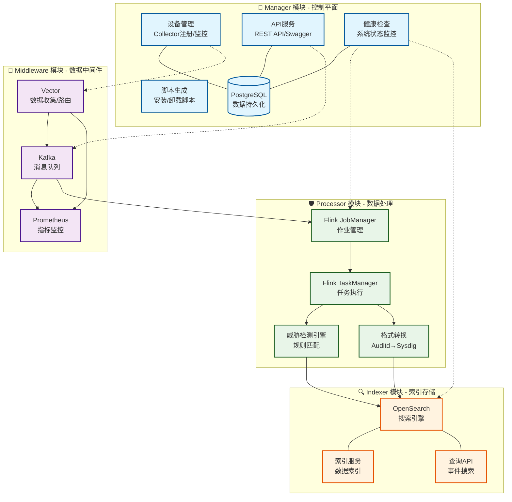
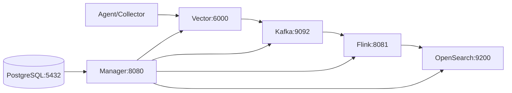

# SysArmor EDR/HIDS 系统

## 🎯 项目概述

SysArmor 是一个现代化的端点检测与响应(EDR/HIDS)系统，采用**Monorepo + 微服务架构**，支持agentless数据采集、实时威胁检测和智能分析。

## 🏗️ 系统架构



- **Manager** (Go): 控制平面，系统管理和API服务
- **Middleware** (Vector+Kafka): 数据收集和消息队列
- **Processor** (Flink): 实时流处理和威胁检测
- **Indexer** (OpenSearch): 数据索引和搜索服务

### 系统组件


## 🚀 快速开始

### 1. 一键启动
```bash
# 克隆项目
git clone https://github.com/sysarmor/sysarmor-stack.git
cd sysarmor-stack/sysarmor

# 启动所有服务
docker compose up -d

# 验证部署
make health
```

### 2. 访问服务
- **管理界面**: http://localhost:8080
- **API文档**: http://localhost:8080/swagger/index.html
- **Flink监控**: http://localhost:8081
- **OpenSearch**: http://localhost:9200

### 3. 注册设备
```bash
# 注册新设备
curl -X POST http://localhost:8080/api/v1/collectors/register \
  -H "Content-Type: application/json" \
  -d '{
    "hostname": "web-server-01",
    "ip_address": "192.168.1.100",
    "os_type": "linux",
    "deployment_type": "agentless"
  }'

# 下载安装脚本
curl "http://localhost:8080/api/v1/scripts/setup-terminal.sh?collector_id=xxx" -o install.sh
```

## ⚙️ 环境配置

### 核心配置项

SysArmor使用`.env`文件管理所有配置，支持12-Factor App模式：

```bash
# 复制配置模板
cp .env.example .env
```

### 主要配置分类

#### 🌐 网络配置
```bash
SYSARMOR_NETWORK=sysarmor-net          # Docker网络名称
EXTERNAL_IP=localhost                   # 外部访问IP
```

#### 🔧 Manager服务 (控制平面)
```bash
MANAGER_HOST=manager                    # Manager主机名
MANAGER_PORT=8080                       # API端口
MANAGER_LOG_LEVEL=info                  # 日志级别
POSTGRES_DB=sysarmor                    # 数据库名
POSTGRES_USER=sysarmor                  # 数据库用户
POSTGRES_PASSWORD=password              # 数据库密码
```

#### 📡 Middleware服务 (数据中间件)
```bash
VECTOR_HOST=middleware-vector           # Vector主机名
VECTOR_TCP_PORT=6000                    # 数据接收端口
VECTOR_API_PORT=8686                    # Vector API端口
KAFKA_HOST=middleware-kafka             # Kafka主机名
KAFKA_INTERNAL_PORT=9092                # Kafka内部端口
KAFKA_EXTERNAL_PORT=9094                # Kafka外部端口
KAFKA_BOOTSTRAP_SERVERS=middleware-kafka:9092
```

#### 🛡️ Processor服务 (数据处理)
```bash
FLINK_JOBMANAGER_HOST=processor-jobmanager
FLINK_JOBMANAGER_PORT=8081              # Flink Web UI端口
FLINK_TASKMANAGER_SLOTS=2               # TaskManager槽位数
FLINK_PARALLELISM=2                     # 作业并行度

# Auditd转换配置
AUDITD_CONVERTER_ENABLED=true           # 启用auditd转换
AUDITD_INPUT_TOPIC=sysarmor-agentless-558c01dd
SYSDIG_OUTPUT_TOPIC=                    # 空则自动生成
```

#### 🔍 Indexer服务 (索引存储)
```bash
OPENSEARCH_HOST=indexer-opensearch      # OpenSearch主机名
OPENSEARCH_PORT=9200                    # OpenSearch端口
OPENSEARCH_USERNAME=admin               # 用户名
OPENSEARCH_PASSWORD=admin               # 密码
INDEX_PREFIX=sysarmor-events            # 索引前缀
```

#### 📊 监控配置
```bash
PROMETHEUS_HOST=middleware-prometheus   # Prometheus主机名
PROMETHEUS_PORT=9090                    # Prometheus端口
WORKER_URLS=middleware-vector:http://middleware-vector:6000:http://middleware-vector:8686/health
```

### 配置自定义

#### 开发环境
```bash
ENVIRONMENT=development
MANAGER_LOG_LEVEL=debug
FLINK_PARALLELISM=1
```

#### 生产环境
```bash
ENVIRONMENT=production
MANAGER_LOG_LEVEL=info
FLINK_PARALLELISM=4
FLINK_TASKMANAGER_SLOTS=4
```

#### 高可用配置
```bash
KAFKA_REPLICATION_FACTOR=3
OPENSEARCH_REPLICAS=1
POSTGRES_MAX_CONNECTIONS=200
```

## 🔧 管理命令

### 服务管理
```bash
make up                       # 启动所有服务
make down                     # 停止所有服务
make restart                  # 重启所有服务
make health                   # 健康检查
make logs                     # 查看日志
```

### 开发工具
```bash
make build                    # 构建所有组件
make test                     # 运行测试
make clean                    # 清理资源
```

## 🌐 API接口

### 核心业务API
- **设备管理**: `/api/v1/collectors/*`
- **安全事件**: `/api/v1/events/*`
- **系统监控**: `/api/v1/health/*`

### 服务管理API
- **Kafka**: `/api/v1/services/kafka/*`
- **Flink**: `/api/v1/services/flink/*`
- **OpenSearch**: `/api/v1/services/opensearch/*`
- **Prometheus**: `/api/v1/services/prometheus/*`

## 🎯 核心特性

### ✅ **实时威胁检测**
- 基于Flink的毫秒级威胁检测
- 支持权限提升、命令注入、网络扫描等威胁类型
- 动态风险评分(0-100)和严重程度分级

### ✅ **Agentless部署**
- 无需在目标主机安装Agent
- 基于rsyslog和auditd的数据采集
- 自动生成安装/卸载脚本

### ✅ **数据格式转换**
- 实时auditd到sysdig格式转换
- 支持NODLINK算法标准
- 智能进程树重建

### ✅ **统一管理**
- Web管理界面
- 完整的REST API
- 一键部署和监控

## 🔍 故障排查

```bash
# 检查服务状态
docker compose ps

# 查看服务日志
docker compose logs [service_name]

# 健康检查
make health

# 重启服务
docker compose restart [service_name]
```

## 📚 文档

- [API参考](docs/manager-api-reference.md) - 完整API文档
- [v0.1功能特性](docs/v0.1-release-features.md) - 版本功能说明
- [Auditd转换指南](docs/auditd-to-sysdig-integration-guide.md) - 格式转换集成

---

**SysArmor EDR/HIDS** - 现代化端点检测与响应系统

**🔗 快速开始**: `git clone && cd sysarmor && make up`  
**📚 文档**: https://docs.sysarmor.com  
**🐛 反馈**: https://github.com/sysarmor/sysarmor/issues
