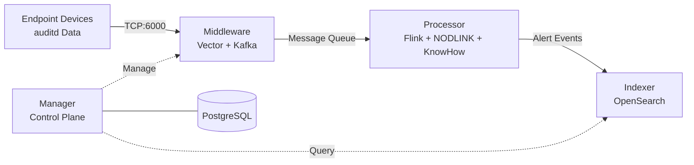

# SystemX EDR/HIDS System

## 🎯 Project Overview

SystemX is a modern Endpoint Detection and Response (EDR/HIDS) system built with a microservices architecture, enabling agentless data collection, real-time threat detection, and alert storage in a complete data pipeline.

### System Architecture


### Core Features
- 🚀 **Agentless Deployment** - Based on rsyslog + auditd, no agent installation required
- 🔧 **Microservices Architecture** - Four main modules: Manager, Middleware, Processor, and Indexer
- 📊 **Real-Time Threat Detection** - Flink stream processing + NODLINK + KnowHow algorithm
- 🔍 **Alert Storage and Query** - OpenSearch indexing and REST API
- 🐳 **Containerized Deployment** - One-click deployment with Docker Compose

## 🚀 Quick Start

### One-Click Deployment
```bash
git clone https://github.com/PKU-ASAL/sysarmor.git
cd sysarmor

# Initialize and deploy (one-click)
make init && make deploy
```

**After deployment, the system will automatically**:
- ✅ Start all services (Manager, Kafka, Flink, OpenSearch, etc.)
- ✅ Submit core Flink jobs (data transformation and alert generation)
- ✅ Activate the complete data pipeline (auditd → events → alerts)

### Quick Verification

#### 1. System Health Check
```bash
make health
# Or
./tests/test-system-health.sh
```

#### 2. API Interface Testing
```bash
./tests/test-system-api.sh
```

#### 3. Data Pipeline Testing
```bash
# Import test data
./tests/import-events-data.sh ./data/kafka-imports/sysarmor-agentless-samples.jsonl

# View processing results
./scripts/kafka-tools.sh export sysarmor.events.audit 5
./scripts/kafka-tools.sh export sysarmor.alerts.audit 5

# Check alerts in OpenSearch
curl -s 'http://localhost:8080/api/v1/services/opensearch/events/search?index=sysarmor-alerts-audit&size=10' | jq
```

### System Access URLs
- **🌐 Manager API**: http://localhost:8080
- **📖 API Documentation**: http://localhost:8080/swagger/index.html
- **🔧 Flink Monitoring**: http://localhost:8081
- **📊 Prometheus**: http://localhost:9090
- **🔍 OpenSearch**: http://localhost:9200

## 🔧 Management Commands

### Basic Operations
```bash
make deploy      # 🎯 Full deployment (recommended)
make up          # Start services (without rebuilding)
make down        # Stop all services
make restart     # Restart all services
make status      # Check service status
make health      # Quick health check
make test        # Full system test
make clean       # Clean up the environment
```

### Utility Scripts
```bash
# System Testing
./tests/test-system-health.sh        # Quick health check
./tests/test-system-api.sh           # Full API test (53 endpoints)
./tests/import-events-data.sh        # Import event data

# Kafka Management
./scripts/kafka-tools.sh list        # List topics (quick)
./scripts/kafka-tools.sh list --count # Show message count (slower)
./scripts/kafka-tools.sh export sysarmor.raw.audit 100

# Flink Management
./scripts/flink-tools.sh list        # View job status
./scripts/flink-tools.sh overview    # Cluster overview
```

## 📚 Documentation

For detailed documentation, refer to the [docs/](docs/) directory:
- **[API Documentation](docs/api-reference.md)** - Manager API reference (53 endpoints, 98% test coverage)
- **[Module Development Guides](docs/development/)** - Wazuh integration, ML services, and more (in progress)
- **[Release Notes](docs/releases/v0.1.0.md)** - Version release details

---

**SystemX EDR/HIDS** - A modern Endpoint Detection and Response system
