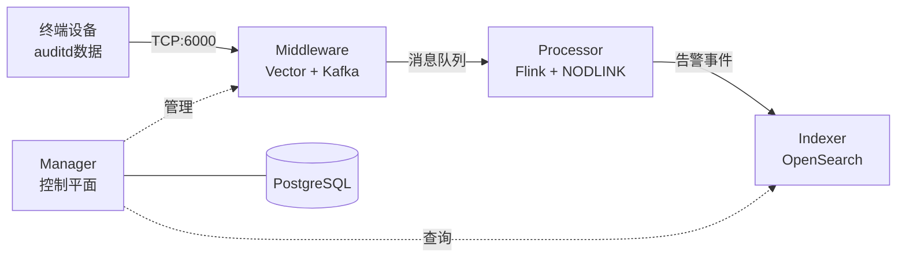

# SysArmor EDR/HIDS 系统

## 🎯 项目概述

SysArmor 是一个现代化的端点检测与响应(EDR/HIDS)系统，采用微服务架构，实现 agentless 数据采集、实时威胁检测和告警存储的完整数据流。

### 系统架构


### 核心特性
- 🚀 **Agentless 部署** - 基于 rsyslog + auditd，无需安装 Agent
- 🔧 **微服务架构** - Manager + Middleware + Processor + Indexer 四大模块
- 📊 **实时威胁检测** - Flink 流处理 + NODLINK 算法
- 🔍 **告警存储查询** - OpenSearch 索引和 REST API
- 🐳 **容器化部署** - Docker Compose 一键部署


## 🚀 快速开始

### 单机部署 (开发测试)
```bash
git clone https://git.pku.edu.cn/oslab/sysarmor.git
cd sysarmor
make init        # 初始化环境(复制.env.example为.env, 创建data目录)
make up          # 启动所有服务
make health      # 验证部署
```

### 分布式部署 (生产推荐)
```bash
# 远程服务器 - 数据收集层
make up-middleware    # Vector + Kafka + Prometheus

# 本地环境 - 管理控制层  
make up-dev          # Manager + Processor + Indexer
```

### 访问服务
- **Manager API**: http://localhost:8080
- **API 文档**: http://localhost:8080/swagger/index.html
- **Flink 监控**: http://localhost:8081
- **OpenSearch**: http://localhost:9200

### 设备接入
1. **注册设备**: 通过 Manager API 注册新设备
2. **下载脚本**: 获取 agentless 安装脚本
3. **部署采集**: 在目标服务器执行脚本，配置 rsyslog + auditd


## 🔧 管理命令

```bash
# 单机部署
make up          # 启动所有服务
make down        # 停止所有服务
make health      # 健康检查

# 分布式部署
make up-middleware    # 启动middleware (远程)
make up-dev          # 启动开发环境 (本地)
make down-dev        # 停止开发环境

# 开发工具
make build           # 构建应用
make docs           # 生成API文档
make test           # 运行测试
```

## 🌐 API 接口

SysArmor 提供完整的 REST API 接口，支持设备管理、系统监控和服务管理：

- **设备管理**: `/api/v1/collectors/*` - 设备注册、状态管理
- **告警查询**: `/api/v1/events/*` - 威胁告警查询和分析
- **系统监控**: `/api/v1/health/*` - 健康检查和指标
- **API 文档**: http://localhost:8080/swagger/index.html


## 📚 文档

- [部署指南](docs/deployment.md) - 分布式部署配置
- [Flink 测试指南](docs/flink-testing.md) - 集群测试和验证
- [系统更新日志](CHANGELOG.md) - 版本历史

## 🧪 快速测试

### 系统健康检查
```bash
# 基础健康检查
make health

# 详细系统健康测试 (20项测试)
./tests/test-system-health.sh

# 查看按逻辑服务分组的健康状态
curl -s http://localhost:8080/api/v1/health | jq '.data.services'
```

### 数据流测试
```bash
# 导入测试数据到 Kafka
./scripts/kafka-tools.sh import data/kafka-imports/sysarmor-agentless-b1de298c_20250905_225242.jsonl sysarmor-events-test

# 查看 Kafka topics 和消息数量
./scripts/kafka-tools.sh list

# 导出验证数据
./scripts/kafka-tools.sh export sysarmor-events-test 5
```

### 服务管理测试
```bash
# Kafka 服务管理
make middleware health
curl -s http://localhost:8080/api/v1/services/kafka/health | jq '.'

# Flink 服务管理  
make processor overview
curl -s http://localhost:8080/api/v1/services/flink/health | jq '.'

# OpenSearch 服务管理
make indexer health
curl -s http://localhost:8080/api/v1/services/opensearch/health | jq '.'
```

### Flink 流处理测试
```bash
# 1. 导入测试数据到 Kafka
./scripts/kafka-tools.sh import data/kafka-imports/sysarmor-agentless-b1de298c_20250905_225242.jsonl sysarmor-events-test

# 2. 查看数据是否导入成功
./scripts/kafka-tools.sh list

# 3. 提交 Flink 控制台测试作业
make processor submit-console

# 4. 查看 Flink 作业状态
make processor list-jobs

# 5. 监控作业输出
# 方法1: 查看 TaskManager 日志中的消息处理输出
docker logs sysarmor-flink-taskmanager-1 -f | grep "🔍 MESSAGE"

# 方法2: 在 Flink Web UI 中查看
# 访问 http://localhost:8081
# 点击 Running Jobs -> 选择作业 -> TaskManagers -> 查看 Logs
# 寻找类似 "🔍 MESSAGE #1", "🔍 MESSAGE #2" 的输出

# 6. 查看 Flink 集群概览
make processor overview

# 7. 获取作业详细信息
# 通过 Manager API 获取作业详情 (包含完整的执行计划、顶点信息等)
curl -s http://localhost:8080/api/v1/services/flink/jobs/{JOB_ID} | jq '.'

# 通过 Flink 原生 API 获取作业详情
curl -s http://localhost:8081/jobs/{JOB_ID} | jq '.'

# 8. 取消运行中的作业
# 获取作业ID
export JOB_ID=$(curl -s http://localhost:8080/api/v1/services/flink/jobs | jq -r '.data.jobs[0].id')

# 取消作业
make processor cancel-job JOB_ID=$JOB_ID

# 通过makefile确认，状态已经变为CANCELED
make processor list-jobs
```

**预期输出示例**：
```
🔍 MESSAGE #1 | Time: 2025-09-05T22:52:42Z | Host: test-host | Collector: b1de298c... | Content: type=SYSCALL msg=audit...
🔍 MESSAGE #2 | Time: 2025-09-05T22:52:43Z | Host: test-host | Collector: b1de298c... | Content: type=EXECVE msg=audit...
```

**注意事项**：
- Flink 作业配置为从 `earliest` 开始读取，会处理 topic 中的所有历史数据
- 每次提交作业会使用新的 Consumer Group，确保从头开始处理
- Console 输出会显示在 TaskManager 日志中，可通过 Flink Web UI 或 Docker 日志查看


---

**SysArmor EDR/HIDS** - 现代化端点检测与响应系统

**🔗 快速开始**: `git clone https://git.pku.edu.cn/oslab/sysarmor.git && cd sysarmor && make up`
