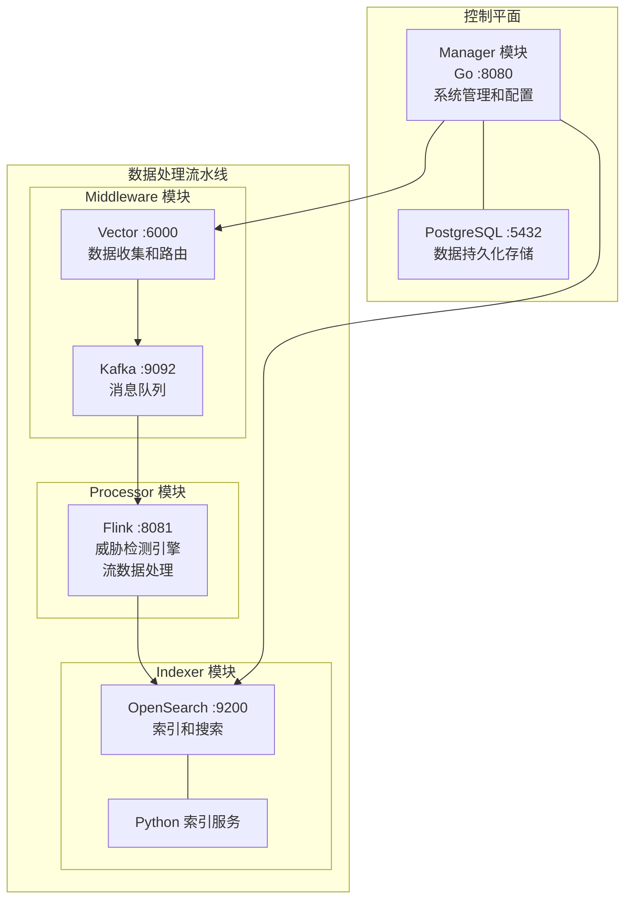

# SysArmor EDR/HIDS 系统

## 🎯 项目概述

SysArmor EDR/HIDS 是一个现代化的端点检测与响应系统，采用**Monorepo + 逻辑模块化架构**，通过 Docker Compose 实现统一的服务编排和管理。

**✅ 架构状态**: 已完成逻辑模块化重构，系统已验证可用于生产部署。

## 🏗️ 系统架构

### 控制平面 + 数据平面架构



## 📁 项目结构

```
sysarmor/
├── docker-compose.yml                  # 🔥 主编排文件 (include 模式)
├── .env.example                        # 环境变量模板
├── Makefile                           # 统一构建和部署命令
├── go.work                            # Go 工作空间配置
│
├── services/                          # 🔥 核心服务模块
│   ├── manager/                       # ✅ 控制平面 (Go + PostgreSQL)
│   ├── middleware/                    # ✅ 数据中间件 (Vector + Kafka)
│   ├── processor/                     # ✅ 数据处理 (PyFlink)
│   └── indexer/                       # ✅ 索引存储 (OpenSearch + Python)
│
├── shared/config/                     # 🔥 共享配置管理库
├── docs/                              # 📚 架构文档
├── examples/                          # 示例配置
└── tests/                             # 测试脚本
```

## 🚀 快速开始

### 1. 环境准备

```bash
# 确保已安装 Docker 和 Docker Compose
docker --version && docker compose version

# 进入项目目录
cd sysarmor
```

### 2. 一键启动

```bash
# 复制环境变量模板 (可选，有默认配置)
cp .env.example .env

# 启动所有服务
docker compose up -d

# 查看服务状态
docker compose ps
```

### 3. 验证部署

```bash
# 健康检查
curl http://localhost:8080/health    # Manager: {"status":"healthy"}
curl http://localhost:8686/health    # Vector: {"ok":true}
curl http://localhost:9200/_cluster/health # OpenSearch: {"status":"green"}
curl http://localhost:8081          # Flink Web UI

# 一键检查所有服务
make health
```

## 🔧 四大核心模块

### 1. **Manager 模块** (控制平面)
- **技术栈**: Go 1.24 + Gin + PostgreSQL 15
- **端口**: Manager :8080, PostgreSQL :5432
- **职责**: 系统管理、配置管理、REST API

### 2. **Middleware 模块** (数据中间件)
- **技术栈**: Vector (Rust) + Apache Kafka (KRaft)
- **端口**: Vector TCP :6000, API :8686, Kafka :9092/9094
- **职责**: 数据收集、消息队列、数据路由

### 3. **Processor 模块** (数据处理)
- **技术栈**: Apache Flink 1.18 + PyFlink
- **端口**: JobManager :8081
- **职责**: 流数据处理、威胁检测、规则引擎

### 4. **Indexer 模块** (索引存储)
- **技术栈**: OpenSearch 2.11 + Python 3.11
- **端口**: OpenSearch :9200
- **职责**: 数据索引、搜索服务、数据存储

## ⚙️ 配置管理

### 12-Factor App 配置

所有配置通过环境变量管理，支持三种配置方式：

1. **环境变量注入** (根目录 `.env`)
2. **配置文件挂载** (Volume 挂载)
3. **服务发现** (Docker DNS)

### 主要配置项

```bash
# 全局配置
ENVIRONMENT=development
SYSARMOR_NETWORK=sysarmor-net

# Manager 模块
MANAGER_PORT=8080
POSTGRES_DB=sysarmor

# Middleware 模块
VECTOR_TCP_PORT=6000
KAFKA_CLUSTER_ID=0203ecef23a24688af6901b94ebafa80

# Processor 模块
FLINK_JOBMANAGER_PORT=8081
FLINK_TASKMANAGER_SLOTS=2

# Indexer 模块
OPENSEARCH_USERNAME=admin
INDEX_PREFIX=sysarmor-events
```

## 🛠️ 服务管理

### 统一管理

```bash
# 服务控制
docker compose up -d          # 启动所有服务
docker compose down           # 停止所有服务
docker compose restart        # 重启所有服务

# 监控调试
docker compose ps             # 查看服务状态
docker compose logs -f        # 查看实时日志
docker compose logs manager   # 查看特定服务日志
```

### 模块化部署

```bash
# 独立启动单个模块 (开发测试)
docker compose -f services/manager/docker-compose.yml up -d
docker compose -f services/middleware/docker-compose.yml up -d
docker compose -f services/processor/docker-compose.yml up -d
docker compose -f services/indexer/docker-compose.yml up -d
```

### Makefile 命令

```bash
make help                     # 显示所有可用命令
make up                       # 启动所有服务
make down                     # 停止所有服务
make health                   # 健康检查
make logs                     # 查看日志
make build                    # 构建所有组件
make test                     # 运行测试
```

## 🌐 服务端点

| 模块 | 服务 | 端口 | 用途 |
|------|------|------|------|
| Manager | Manager | 8080 | REST API, Web UI |
| Manager | PostgreSQL | 5432 | 数据库服务 |
| Middleware | Vector TCP | 6000 | 数据接收端口 |
| Middleware | Vector API | 8686 | 管理 API |
| Middleware | Kafka | 9092/9094 | 消息队列 |
| Processor | Flink JobManager | 8081 | 作业管理, Web UI |
| Indexer | OpenSearch | 9200 | 搜索 API, 数据存储 |

### Web 界面

- **Manager API**: http://localhost:8080 - 系统管理
- **Vector API**: http://localhost:8686 - 数据收集状态
- **Flink Web UI**: http://localhost:8081 - 流处理作业管理
- **OpenSearch**: http://localhost:9200 - 搜索和数据查询

## 🎯 架构优势

### ✅ **逻辑模块化**
- 每个模块包含完整功能栈和相关基础设施
- 支持模块级别的独立启停和测试
- 明确的服务职责和模块边界

### ✅ **配置统一**
- 12-Factor App 最佳实践
- 根目录 `.env` 文件统一管理所有配置
- 支持环境变量注入和配置文件挂载

### ✅ **部署简化**
- `docker compose up -d` 一键启动所有模块
- include 模式：根目录编排，模块独立配置
- Docker 原生服务发现，无需额外组件

### ✅ **运维友好**
- 标准化健康检查接口
- 集中化日志管理和查看
- 支持 Prometheus 指标收集

## 🔍 故障排查

### 常见问题

```bash
# 1. 检查服务状态
docker compose ps

# 2. 查看服务日志
docker compose logs [service_name]

# 3. 验证配置
docker compose config --quiet

# 4. 重建服务
docker compose down && docker compose up -d

# 5. 健康检查
make health
```

### 日志分析

```bash
# 实时监控所有服务
docker compose logs -f

# 查看特定时间段的日志
docker compose logs --since 1h manager

# 搜索错误日志
docker compose logs | grep -i error
```

## 🎯 技术栈总览

- **Manager**: Go 1.24 + Gin + PostgreSQL 15
- **Middleware**: Vector (Rust) + Apache Kafka (KRaft)
- **Processor**: Apache Flink 1.18 + PyFlink
- **Indexer**: OpenSearch 2.11 + Python 3.11
- **配置**: 12-Factor App (环境变量驱动)
- **编排**: Docker Compose (include 模式)

## 📚 文档

- [架构总结](docs/architecture-summary.md) - 架构概览
- [详细设计](docs/improved-architecture-design.md) - 完整架构设计
- [配置分析](docs/configuration-analysis.md) - 配置传入方式
- [实施计划](docs/migration-implementation-plan.md) - 重构实施计划

---

**SysArmor EDR/HIDS** - 现代化端点检测与响应系统，Monorepo 逻辑模块化架构，生产就绪。

**🎯 当前状态**: 8 个核心服务健康运行，系统完全可用！
