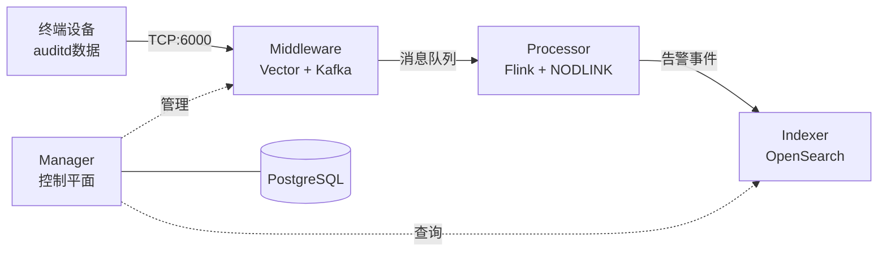

# SysArmor EDR/HIDS 系统

## 🎯 项目概述

SysArmor 是一个现代化的端点检测与响应(EDR/HIDS)系统，采用微服务架构，实现 agentless 数据采集、实时威胁检测和告警存储的完整数据流。

### 系统架构


### 核心特性
- 🚀 **Agentless 部署** - 基于 rsyslog + auditd，无需安装 Agent
- 🔧 **微服务架构** - Manager + Middleware + Processor + Indexer 四大模块
- 📊 **实时威胁检测** - Flink 流处理 + NODLINK 算法
- 🔍 **告警存储查询** - OpenSearch 索引和 REST API
- 🐳 **容器化部署** - Docker Compose 一键部署


## 🚀 快速开始

### 一键部署
```bash
git clone https://git.pku.edu.cn/oslab/sysarmor.git
cd sysarmor

# 初始化并部署 (一键完成)
make init && make deploy
```

**部署完成后，系统会自动**:
- ✅ 启动所有服务 (Manager、Kafka、Flink、OpenSearch等)
- ✅ 提交核心Flink作业 (数据转换和告警生成)
- ✅ 激活完整数据流 (auditd → events → alerts)

### 快速验证

#### 1. 系统健康检查
```bash
make health
# 或者
./tests/test-system-health.sh
```

#### 2. API接口测试
```bash
./tests/test-system-api.sh
```

#### 3. 数据流测试
```bash
# 导入测试数据
./tests/import-events-data.sh ./data/kafka-imports/sysarmor-agentless-samples.jsonl

# 查看处理结果
./scripts/kafka-tools.sh export sysarmor.events.audit 5
./scripts/kafka-tools.sh export sysarmor.alerts.audit 5

# 查看OpenSearch中的告警
curl -s 'http://localhost:8080/api/v1/services/opensearch/events/search?index=sysarmor-alerts-audit&size=10' | jq
```

### 系统访问地址
- **🌐 Manager API**: http://localhost:8080
- **📖 API 文档**: http://localhost:8080/swagger/index.html
- **🔧 Flink 监控**: http://localhost:8081
- **📊 Prometheus**: http://localhost:9090
- **🔍 OpenSearch**: http://localhost:9200

## 🔧 管理命令

### 基础操作
```bash
make deploy      # 🎯 完整部署 (推荐)
make up          # 启动服务 (不重新构建)
make down        # 停止所有服务
make restart     # 重启所有服务
make status      # 查看服务状态
make health      # 快速健康检查
make test        # 完整系统测试
make clean       # 清理环境
```

### 工具脚本
```bash
# 系统测试
./tests/test-system-health.sh        # 快速健康检查
./tests/test-system-api.sh           # 完整API测试 (53个接口)
./tests/import-events-data.sh        # 事件数据导入

# Kafka管理
./scripts/kafka-tools.sh list        # 列出topics (快速)
./scripts/kafka-tools.sh list --count # 显示消息数量 (较慢)
./scripts/kafka-tools.sh export sysarmor.raw.audit 100

# Flink管理
./scripts/flink-tools.sh list        # 查看作业状态
./scripts/flink-tools.sh overview    # 集群概览
```

## 📚 文档

详细文档请参考 [docs/](docs/) 目录：
- **[API文档](docs/api-reference.md)** - Manager API接口文档 (53个接口，98%测试通过)
- **[各模块开发指南](docs/development/)** - Wazuh集成、ML服务等开发文档（实施中）
- **[版本发布](docs/releases/v0.1.0.md)** - 版本发布说明

---

**SysArmor EDR/HIDS** - 现代化端点检测与响应系统
