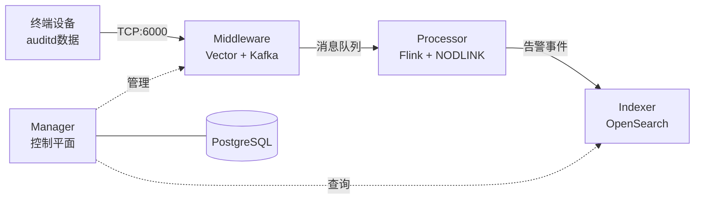

# SysArmor EDR/HIDS 系统

## 🎯 项目概述

SysArmor 是一个现代化的端点检测与响应(EDR/HIDS)系统，采用微服务架构，实现 agentless 数据采集、实时威胁检测和告警存储的完整数据流。

### 系统架构


### 核心特性
- 🚀 **Agentless 部署** - 基于 rsyslog + auditd，无需安装 Agent
- 🔧 **微服务架构** - Manager + Middleware + Processor + Indexer 四大模块
- 📊 **实时威胁检测** - Flink 流处理 + NODLINK 算法
- 🔍 **告警存储查询** - OpenSearch 索引和 REST API
- 🐳 **容器化部署** - Docker Compose 一键部署


## 🚀 快速开始

### 单机部署 (开发测试)
```bash
git clone https://git.pku.edu.cn/oslab/sysarmor.git
cd sysarmor

# 初始化环境
# 1. 复制.env.example为.env
# 2. 创建./data目录
# 3. 在./services/indexer/configs/opensearch/certs目录下生成opensearch证书
make init        

# 构建并启动所有服务
make deploy

# 验证部署
make health

# 停止所有服务并清理资源(volume, network等)
make down        
```

### 分布式部署

WIP

### 访问服务
- **Manager API**: http://localhost:8080
- **API 文档**: http://localhost:8080/swagger/index.html
- **Flink 监控**: http://localhost:8081
- **OpenSearch**: http://localhost:9200

### 设备接入
1. **注册设备**: 通过 Manager API 注册新设备
2. **下载脚本**: 获取 agentless 安装脚本
3. **部署采集**: 在目标服务器执行脚本，配置 rsyslog + auditd


## 🔧 管理命令

```bash
# 单机部署
make up          # 启动所有服务
make deply       # 重新构建镜像，并启动所有服务
make down        # 停止所有服务
make health      # 健康检查
```

## 📚 文档

详细文档请参考 [docs/](docs/) 目录：
- **[快速开始](docs/guides/quick-start.md)** - 5分钟完成部署和测试验证
- **[系统概览](docs/guides/overview.md)** - 系统架构和部署方案
- **[API参考](docs/development/api-reference.md)** - 完整的API接口文档
- **[v0.1.0 Release Notes](docs/releases/v0.1.0-release-notes.md)** - 版本发布说明


---

**SysArmor EDR/HIDS** - 现代化端点检测与响应系统
