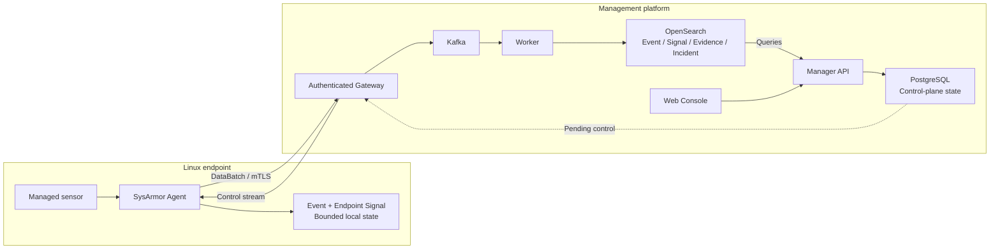

# SysArmor

English | [简体中文](README.zh-CN.md)

SysArmor is an endpoint security and correlation system for Linux. The Agent runs standalone by default and owns local collection, detection, and bounded persistence. After enrollment, the management platform adds centralized policy, durable upload, entity-graph correlation, investigation, and response orchestration.

The project is under active development and is intended for development, evaluation, and testing. Interfaces and deployment procedures may change before a stable release.

## Design Principles

- **Dynamic defense:** one control plane adjusts collection, detection, telemetry, and response as the threat and environment change.
- **Efficiency balance:** Event, Signal, Evidence, and Incident progressively retain security meaning under explicit CPU, memory, disk, and network budgets.
- **Endpoint-cloud collaboration:** the endpoint performs low-latency filtering and detection; the platform correlates history and entity graphs within tenant, scope, and time boundaries.

The canonical principles and current-versus-target boundaries are documented in [Design Principles](docs/design-principles.zh-CN.md).

## Architecture


```mermaid
flowchart LR
  subgraph Endpoint["Linux endpoint"]
    Sensor["Managed sensor"] --> Agent["SysArmor Agent"]
    Agent --> Local["Event + Endpoint Signal<br/>Bounded local state"]
  end

  subgraph Platform["Management platform"]
    Gateway["Authenticated Gateway"] --> Kafka
    Kafka --> Worker
    Worker --> Search["OpenSearch<br/>Event / Signal / Evidence / Incident"]
    Search -->|"Queries"| Manager["Manager API"]
    Console["Web Console"] --> Manager
    Manager --> ControlDB["PostgreSQL<br/>Control-plane state"]
    ControlDB -.->|"Pending control"| Gateway
  end

  Agent -->|"DataBatch / mTLS"| Gateway
  Gateway -->|"Control stream"| Agent
```

The Agent continues local collection, detection, and queries while unenrolled or disconnected. Enrollment adds upload and control without creating a second endpoint data path. See [System Architecture](docs/architecture.md).

## Quickstart

On a systemd-based x86_64 Linux host:

```bash
make install-agent
sudo sysarmorctl agent health
sudo sysarmorctl event watch --include-recent
sudo sysarmorctl signal watch --include-recent
```

You can also select a development pre-release on GitHub Releases and run the exact install command shown
on that release. Public pre-releases install in standalone mode by default. See [Deployment](docs/operations/deployment.md)
for verification, platform limits, and offline distribution constraints.

See [Quickstart](docs/quickstart.md) for prerequisites, verification, and next steps.

## Development And Testing

```bash
make build-binary
make test-unit
make test-doctor
make test-performance PROFILE=medium
make test-help
```

Product, Effectiveness, and Performance suites answer different questions and do not substitute for each other. See [Testing](docs/development/testing.md).

## Documentation

- [Documentation home](docs/index.md)
- [Design principles](docs/design-principles.zh-CN.md)
- [System architecture](docs/architecture.md)
- [Policy guide](docs/guides/policy.md)
- [Agent management](docs/guides/agent-management.md)
- [Investigation guide](docs/guides/investigation.md)
- [Deployment](docs/operations/deployment.md)
- [Configuration reference](docs/reference/configuration.md)
- [API reference](docs/reference/api.md)
- [CLI reference](docs/reference/cli.md)
- [Development](docs/development/development.md)
- [Testing](docs/development/testing.md)

See [CATALOG](CATALOG.md) for document ownership and maintenance rules.

## License

SysArmor is licensed under the [Mulan Permissive Software License, Version 2](LICENSE) (`MulanPSL-2.0`). Third-party components remain subject to their respective licenses.
