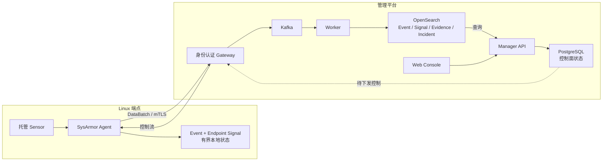

# SysArmor

[English](README.md) | 简体中文

SysArmor 是面向 Linux 的端点安全与关联分析系统。Agent 默认独立运行，在主机本地管理采集、检测和有界保存；接入管理平台后，系统增加集中策略、可靠上传、实体图关联、调查和响应编排能力。

项目处于活跃开发阶段，适合开发、评估和测试；稳定版本发布前，接口与部署流程仍可能变化。

## 设计原则

- **动态博弈：** collection、detection、telemetry、response 通过统一控制平面持续调整，为受约束的 Agentic 策略奠定基础。
- **效能平衡：** Event、Signal、Evidence、Incident 分层保留安全信息，在行为粒度与 CPU、内存、磁盘、网络成本之间建立可测量边界。
- **端云协同：** 端侧完成低延迟过滤和检测，云侧在 tenant、作用域和时间窗口约束下进行历史与实体图关联。

完整定义、当前基础和目标能力边界见[设计原则](docs/design-principles.zh-CN.md)。

## 系统结构



Agent 未注册或断网时仍可本地采集、检测和查询。注册只增加上传与控制能力，不会创建第二条端点数据路径。详见[系统架构](docs/architecture.md)。

## 快速开始

在使用 systemd 的 x86_64 Linux 主机上：

```bash
make install-agent
sudo sysarmorctl agent health
sudo sysarmorctl event watch --include-recent
sudo sysarmorctl signal watch --include-recent
```

也可以从 GitHub Releases 选择目标版本，执行其页面提供的一键安装命令。候选版本标记为
Pre-release，验收通过的版本发布为正式版本；公开发行包默认安装为 standalone。详细的校验、
平台限制和离线分发边界见[部署指南](docs/operations/deployment.md)。

完整前置条件、验证步骤和下一步见[快速开始](docs/quickstart.md)。

## 开发与测试

```bash
make build-binary
make test-unit
make test-doctor
make test-performance DOMAIN=endpoint PROFILE=medium
make test-help
```

Functional、Detection 和 Performance 测试回答不同问题，不应互相替代。详见[测试指南](docs/development/testing.md)。

## 文档

- [文档首页](docs/index.md)
- [设计原则](docs/design-principles.zh-CN.md)
- [系统架构](docs/architecture.md)
- [策略指南](docs/guides/policy.md)
- [Agent 管理](docs/guides/agent-management.md)
- [调查指南](docs/guides/investigation.md)
- [部署指南](docs/operations/deployment.md)
- [配置参考](docs/reference/configuration.md)
- [API 参考](docs/reference/api.md)
- [CLI 参考](docs/reference/cli.md)
- [开发指南](docs/development/development.md)
- [测试指南](docs/development/testing.md)

完整文档职责和维护规则见 [CATALOG](CATALOG.md)。

## 许可证

SysArmor 使用[木兰宽松许可证，第 2 版](LICENSE)（`MulanPSL-2.0`）。第三方组件仍适用其各自的许可证。
