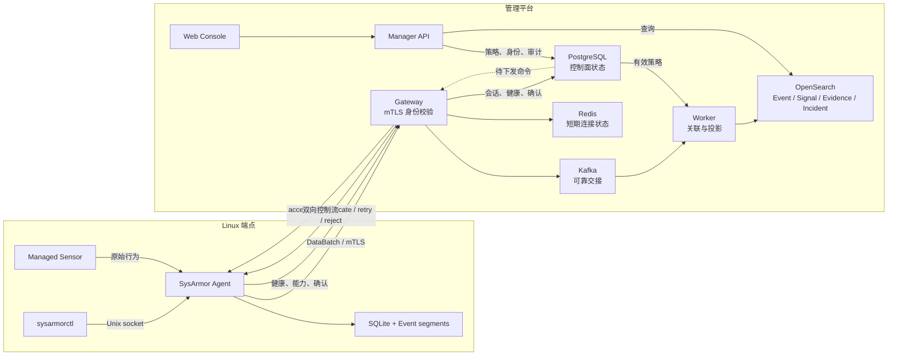
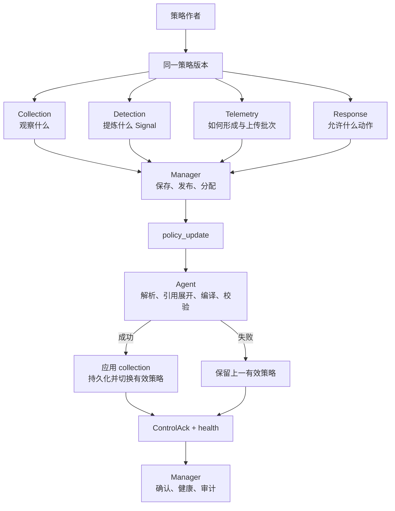
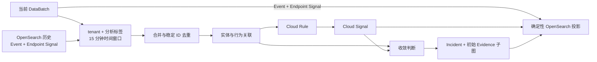

# SysArmor 系统架构

本文解释 SysArmor 的 Agent、控制平面、数据平面和云侧分析如何协作。设计动机见[设计原则](design-principles.zh-CN.md)，具体配置字段和接口分别以 [Configuration Reference](reference/configuration.md) 与 [API Reference](reference/api.md) 为准。

## 架构目标

SysArmor 面向持续变化的主机攻防，而不是一次性的日志收集。系统需要同时保持三项性质：端点在离线时仍能采集和检测；控制平面可以统一调整 collection、detection、telemetry、response；云侧可以在租户和分析作用域内关联更长时间窗口的数据。



这条链路由三个边界组成：Agent 负责端点自治；Gateway、Kafka 和 Worker 负责可靠接入与分析；Manager 负责身份、策略、查询和操作流程。云侧增强 Agent，但不替代本地运行时。

## 安全数据模型

| 概念 | 定义 | 典型来源 |
|---|---|---|
| Event | 对进程、文件、网络、身份或系统状态的一次规范化事实记录 | Agent 和 sensor |
| Signal | 从 Event、既有 Signal、运行状态或关系中提炼的结构化行为信号 | 端点检测或云侧分析 |
| Evidence | 支持 Signal 或 Incident 的可复核依据，包括引用、实体、关系和必要的原始材料 | Agent 引用、Evidence 子图或受控回拉 |
| Incident | 由相关 Signal 与 Evidence 在明确作用域内收敛出的可重复安全分析报告 | 云侧分析 |

Signal 不是传统告警的同义词。它位于高吞吐原始事实与高置信安全结论之间，可以表示值得保留的行为、局部异常、规则命中或健康状态。Signal 是否恶意、是否应形成 Incident，由规则、上下文、关联结果和有效策略共同决定。

Incident 是可重复计算的分析报告，不是可变的工单。人工处置、负责人、评论和关闭状态属于案件管理，目前不在 Incident 模型内。调查方法见[调查指南](guides/investigation.md)。

## Agent 端点自治

### 运行模式

安装后，Agent 立即以 **standalone** 模式运行：创建本地设备身份、管理 sensor、规范化 Event、执行端点检测、保存有界数据并产生 Endpoint Signal，不连接 Manager 或 Gateway。

注册操作会原子地切换到 **managed** 模式。原有采集和检测路径保持不变，只增加经身份认证的数据上传和控制通道。取消注册会移除云侧凭据并回到 standalone，不应停止本地采集。

### 本地职责

Agent 负责：

- 管理 sensor 生命周期，将 collection intent 编译为 sensor 能力；
- 规范化 Event，执行低延迟检测并生成 Endpoint Signal；
- 原子应用统一端点策略，并持久化有效版本；
- 在网络中断时继续工作，恢复后从确认的 checkpoint 续传；
- 通过本地 Unix socket 提供健康、策略、查询、内容和注册操作；
- 在授权范围内执行响应并返回确认。

`sysarmorctl` 只通过 `/run/sysarmor/agent/control.sock` 操作 Agent，不直接读取 SQLite 或事件段文件。运行路径的完整契约见 [Configuration Reference](reference/configuration.md)。

### 有界持久化

SQLite 保存设备身份、注册状态、有效策略、Signal、事件段元数据和上传 checkpoint；高吞吐 Event 写入有界追加段。容量限制和最小剩余空间防止本地状态无限增长。

默认打包配置目前使用 10 GiB 本地状态上限、2 GiB 最小文件系统剩余空间、64 MiB 事件段和 100,000 条 Signal 保留上限。这些是可配置默认值，不是架构常量。

空间回收先清理超量 Signal，再优先删除已经上传的旧密封段；如果压力迫使 Agent 丢弃尚未上传的数据，必须增加 storage-drop 计数，不能把丢失报告成成功上传。启动时会校验 SQLite 与事件段：不完整的活动段尾部可截断到最后一条完整记录，非法头、非法记录、密封段损坏或多个活动段会显式导致启动失败。

## 统一控制平面

端点策略由同一版本中的四个部分构成：



策略更新必须先解析、校验和编译，成功后才能替换有效版本；有效策略会持久化，重启不会静默退回安装包默认值。Manager 负责策略分配和下发，Agent 报告能力、健康状态与实际有效版本。具体操作与安全约束见[策略指南](guides/policy.md)。

本地 Unix API 还支持内容查询与应用、Event 查询、debug profile 和策略操作。远程 `Connect` 控制通道负责策略与内容下发、response、Evidence pullback，以及 health/capability 状态交互；当前不提供远程 Event 查询或 debug profile。端点私钥在本机生成，注册时提交 CSR；签发证书使用以下 URI 身份：

```text
spiffe://sysarmor.local/tenant/<tenant_id>/agent/<agent_id>
```

Gateway 会将该身份与每个上报的 tenant ID 和 Agent ID 交叉校验。Manager 的操作员身份来自已验证的短期 RS256 JWT；调用者自报的身份 Header 不能建立身份。Web Console 的服务端 BFF 签发 Manager JWT，浏览器不直接接触 JWT 或 Manager 内部地址。

## 数据平面与可靠性

完成注册的 Agent 只上传策略允许的 Event 和 Signal。注册不会创建第二条采集路径，也不会自动上传注册前的历史数据；历史上传必须显式请求。

Agent 以批次发送数据，Gateway 返回 accepted、duplicate、retryable 或 terminally invalid。只有 accepted 或 duplicate 确认可以推进本地 checkpoint。Gateway 完成身份和批次校验后，将数据交给 Kafka；Worker 在完成必需投影后才提交 Kafka offset。

永久非法输入只有在 dead-letter 记录可靠写入后才能提交。临时错误不提交并等待重试。派生文档使用确定性 ID，因此重复批次、Worker 重试和局部 Bulk 成功会重放到同一逻辑结果，而不是放大 Signal 或 Incident。

## 云侧分析

Worker 当前按 `tenant_id` 和分析标签限定作用域。分析标签从 `case_type`、`scenario`、`workload` 中选择；每个受影响作用域合并当前批次与 OpenSearch 中 15 分钟历史窗口内的 Event 和 Endpoint Signal，再根据有效检测策略重新计算 Cloud Signal 和 Incident。



实体图由 Signal 中的实体及关系构建。代码库当前具备 Evidence 子图、K-hop 邻域和最短路径算法基础；Incident 当前保存贡献 Signal、实体关系、收敛轨迹和稳定分析标识。完整因果路径恢复、候选攻击路径排序、攻击阶段推理和自然语言根因解释不能由这些基础能力直接推导为已实现产品能力。

## 平台组件与存储职责

| 组件或存储 | 责任 |
|---|---|
| Gateway | 验证 Agent 身份，接收数据，维护控制连接 |
| Kafka | 保存等待处理的 telemetry，提供可靠交接 |
| Worker | 读取历史、执行关联、生成并投影派生数据 |
| Manager | 提供注册、策略、响应、查询和审计接口 |
| PostgreSQL | Agent、注册、制品、通道、策略、响应和审计等控制面状态 |
| OpenSearch | Event、Signal、Evidence 和可重复 Incident 报告 |
| Redis | Gateway 的短期连接与恢复状态 |

查询边界取决于运行范围：端点测试可以通过 Agent 本地流验证端点行为；包含 Manager 和 Gateway 的拓扑必须通过 Manager API 查询，并显式提供 tenant 上下文。内部数据库格式不是用户接口。

## 失败边界

系统遵循以下不变量：

- 云侧不可用不能使本地采集和检测停止；
- 未持久化的本地写入不能报告成功；
- 未获可靠确认的上传不能推进 checkpoint；
- 未完成必需投影的 Worker 不能提交来源消息；
- 数据丢弃、解析错误、队列溢出和策略失败必须进入健康状态或审计；
- 关联不能跨 tenant 或既定分析作用域；
- Agentic 建议不能绕过策略校验、作用域、资源预算、审批和审计。

## 能力边界

| 状态 | 能力 |
|---|---|
| 当前已具备 | standalone/managed 切换、本地检测与有界存储、统一端点策略、注册与 mTLS、可靠批次上传、15 分钟历史关联、Endpoint/Cloud Signal、稳定 Incident 与 Evidence 投影、基础实体图算法 |
| 工程基础已具备但仍需产品化 | 完整 Incident 调查体验、Evidence 到原始材料的连续回溯、策略和资源预算的统一可视化 |
| 目标能力 | 风险触发的临时加深采集与自动恢复、候选路径排序、攻击阶段推理、自然语言根因解释、受约束的 Agentic 策略调优 |

“目标能力”描述架构方向，不应在测试报告、发布说明或商业材料中作为当前能力陈述。

## 继续阅读

- [设计原则](design-principles.zh-CN.md)：为什么采用动态博弈、效能平衡和端云协同。
- [策略指南](guides/policy.md)：如何理解和调整四层统一策略。
- [调查指南](guides/investigation.md)：如何解释 Event、Signal、Evidence 和 Incident。
- [部署指南](operations/deployment.md)：如何部署 Agent 和平台。
- [API Reference](reference/api.md)：控制面、数据面和查询接口的精确契约。
