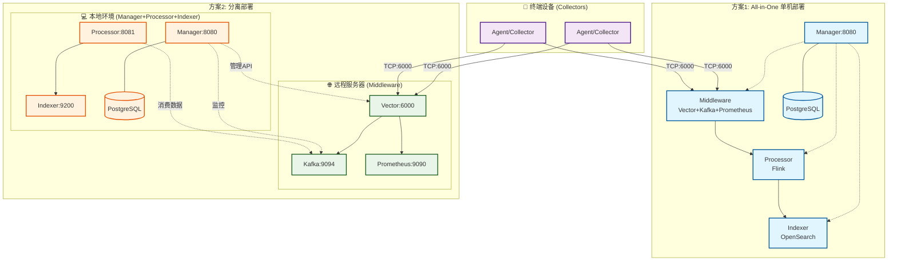

# SysArmor 分布式部署指南

## 📋 概述

SysArmor EDR/HIDS 系统提供两种主要部署方案：All-in-One 单机部署和 Manager + Middleware 分离部署。本指南介绍如何使用不同的 Docker Compose 配置文件和环境变量文件来实现这两种部署场景。

## 🏗️ 部署架构



## 🚀 部署方案

### 方案1: All-in-One 单机部署
**使用文件**: `docker-compose.yml` + `.env`

所有服务部署在同一台机器上，适用于开发测试和小规模生产环境。

```bash
# 1. 复制环境配置
cp .env.example .env

# 2. 启动完整集群
make up
# 或者: docker compose up -d

# 3. 验证部署
make health
curl http://${MANAGER_HOST:-localhost}:${MANAGER_PORT:-8080}/swagger/index.html
```

**服务端口**:
- Manager API: http://${MANAGER_HOST:-localhost}:${MANAGER_PORT:-8080}
- Flink Web UI: http://localhost:8081  
- OpenSearch: http://localhost:9200
- Prometheus: http://localhost:9090
- Vector数据收集: tcp://localhost:6000

### 方案2: Manager + Middleware 分离部署
**远程Middleware**: `docker-compose.middleware.yml` + `.env.middleware`  
**本地Manager等**: `docker-compose.dev.yml` + `.env.dev`

Middleware部署在远程服务器，Manager、Processor、Indexer部署在本地。

#### 步骤1: 远程服务器部署Middleware
```bash
# 在远程服务器执行
git clone https://github.com/sysarmor/sysarmor-stack.git
cd sysarmor-stack/sysarmor

# 使用middleware专用配置
cp .env.example .env.middleware
vim .env.middleware
# 设置: MIDDLEWARE_HOST=远程服务器IP

# 启动middleware服务
make up-middleware
# 或者: docker compose -f docker-compose.middleware.yml up -d

# 配置防火墙
sudo ufw allow 6000/tcp    # Vector数据收集
sudo ufw allow 8686/tcp    # Vector API
sudo ufw allow 9094/tcp    # Kafka外部端口
sudo ufw allow 9090/tcp    # Prometheus
```

#### 步骤2: 本地环境部署Manager等服务
```bash
# 在本地环境执行
cd sysarmor-stack/sysarmor

# 使用开发环境配置
cp .env.example .env.dev
vim .env.dev
# 设置: MIDDLEWARE_HOST=远程服务器IP

# 启动本地服务
make up-dev
# 或者: docker compose -f docker-compose.dev.yml up -d
```

**服务分布**:
- 远程服务器: Vector:6000, Kafka:9094, Prometheus:9090
- 本地环境: Manager:8080, Flink:8081, OpenSearch:9200, PostgreSQL:5432

## 🔧 配置文件详解

### `.env` - All-in-One配置
```bash
# 部署模式
DEPLOYMENT_MODE=single-node
ENVIRONMENT=development

# 所有服务都使用localhost
MANAGER_HOST=localhost
MIDDLEWARE_HOST=localhost
PROCESSOR_HOST=localhost
INDEXER_HOST=localhost

# 端口配置
MANAGER_PORT=8080
VECTOR_TCP_PORT=6000
KAFKA_PORT=9094
FLINK_PORT=8081
OPENSEARCH_PORT=9200
PROMETHEUS_PORT=9090
```

### `.env.middleware` - 远程Middleware配置
```bash
# 部署模式
DEPLOYMENT_MODE=distributed
ENVIRONMENT=production

# 网络配置 (重要!)
MIDDLEWARE_HOST=49.232.13.155       # 设置为远程服务器实际IP

# 核心端口
VECTOR_TCP_PORT=6000
VECTOR_API_PORT=8686
KAFKA_PORT=9094                     # 外部访问端口
PROMETHEUS_PORT=9090

# 网络配置
SYSARMOR_NETWORK=sysarmor-net
```

### `.env.dev` - 本地开发环境配置
```bash
# 部署模式
DEPLOYMENT_MODE=distributed
ENVIRONMENT=development

# Manager服务配置 (本地)
MANAGER_HOST=localhost
MANAGER_PORT=8080

# Middleware服务配置 (远程)
MIDDLEWARE_HOST=49.232.13.155       # 连接到远程middleware

# Processor服务配置 (本地)
PROCESSOR_HOST=localhost
FLINK_PORT=8081

# Indexer服务配置 (本地)
INDEXER_HOST=localhost
OPENSEARCH_PORT=9200

# 自动派生的连接配置
KAFKA_BOOTSTRAP_SERVERS=${MIDDLEWARE_HOST}:${KAFKA_PORT}
OPENSEARCH_URL=http://${INDEXER_HOST}:${OPENSEARCH_PORT}
FLINK_JOBMANAGER_URL=http://${PROCESSOR_HOST}:${FLINK_PORT}
PROMETHEUS_URL=http://${MIDDLEWARE_HOST}:${PROMETHEUS_PORT}
```

## ✅ 部署验证

### 启动服务
```bash
# All-in-One部署
make up

# 分离部署
# 1. 远程服务器
make up-middleware
# 2. 本地环境
make up-dev
```

### 验证服务状态
```bash
# 检查服务状态
make status

# 健康检查
make health
curl http://localhost:8080/health

# 检查各个服务连接
curl http://localhost:8080/api/v1/services/kafka/test-connection
curl http://localhost:8080/api/v1/services/flink/overview
curl http://localhost:8080/api/v1/services/opensearch/cluster/health
```

### 基础功能测试
```bash
# 1. 注册一个测试Collector
curl -X POST http://localhost:8080/api/v1/collectors/register \
  -H "Content-Type: application/json" \
  -d '{
    "hostname": "test-server",
    "ip_address": "192.168.1.100",
    "os_type": "linux",
    "deployment_type": "agentless"
  }'

# 2. 发送测试数据到Vector
echo '{"collector_id":"test-001","message":"deployment test"}' | nc ${MIDDLEWARE_HOST:-localhost} 6000

# 3. 检查Kafka主题
curl http://localhost:8080/api/v1/services/kafka/topics

# 4. 访问API文档
open http://localhost:8080/swagger/index.html
```

## 📊 服务端口映射

### All-in-One部署端口
| 服务 | 端口 | 用途 | 访问地址 |
|------|------|------|----------|
| Manager | 8080 | API服务 | http://localhost:8080 |
| Vector | 6000 | 数据收集 | tcp://localhost:6000 |
| Vector API | 8686 | 健康检查 | http://localhost:8686 |
| Kafka | 9094 | 消息队列 | localhost:9094 |
| Flink JobManager | 8081 | 作业管理 | http://localhost:8081 |
| OpenSearch | 9200 | 搜索引擎 | http://localhost:9200 |
| Prometheus | 9090 | 监控指标 | http://localhost:9090 |
| PostgreSQL | 5432 | 数据库 | localhost:5432 |

### 分离部署端口

#### 远程服务器 (Middleware)
| 服务 | 端口 | 用途 | 防火墙 |
|------|------|------|--------|
| Vector | 6000 | 数据收集 | 必须开放 |
| Vector API | 8686 | 健康检查 | 必须开放 |
| Kafka | 9094 | 消息队列 | 必须开放 |
| Prometheus | 9090 | 监控指标 | 必须开放 |

#### 本地环境 (Manager + Processor + Indexer)
| 服务 | 端口 | 用途 |
|------|------|------|
| Manager | 8080 | API服务 |
| Flink JobManager | 8081 | 作业管理 |
| OpenSearch | 9200 | 搜索引擎 |
| PostgreSQL | 5432 | 数据库 |

## 🚨 故障排查

### 常见问题

#### 1. Kafka连接失败
```bash
# 检查Kafka配置
grep KAFKA_BOOTSTRAP_SERVERS .env*

# 测试Kafka连接
curl http://localhost:8080/api/v1/services/kafka/test-connection

# 检查Kafka容器状态
docker compose logs middleware-kafka
```

#### 2. 服务启动失败
```bash
# 检查容器状态
docker compose ps

# 查看服务日志
docker compose logs manager
docker compose logs processor-jobmanager
docker compose logs middleware-vector

# 重启服务
docker compose restart
```

#### 3. 网络连接问题
```bash
# 测试网络连通性 (分离部署)
ping ${MIDDLEWARE_HOST}
telnet ${MIDDLEWARE_HOST} 6000
telnet ${MIDDLEWARE_HOST} 9094

# 检查防火墙状态
sudo ufw status
```

### 日志查看
```bash
# 查看所有服务日志
make logs

# 查看特定服务日志
docker compose logs manager
docker compose logs processor-jobmanager
docker compose logs middleware-vector
```

## 🎯 最佳实践

### 1. 环境配置
- All-in-One: 使用 `.env` 配置文件
- 分离部署: 使用 `.env.middleware` 和 `.env.dev` 配置文件
- 确保 `MIDDLEWARE_HOST` 配置正确

### 2. 服务启动顺序
```bash
# All-in-One部署
make up

# 分离部署推荐顺序
# 1. 先启动远程Middleware
make up-middleware

# 2. 等待Middleware服务就绪
sleep 30

# 3. 再启动本地服务
make up-dev
```

### 3. 监控和维护
```bash
# 定期健康检查
make health

# 监控资源使用
docker stats

# 备份重要数据
docker exec manager-postgres pg_dump -U sysarmor sysarmor > backup.sql
```

### 4. 性能优化
- Kafka: 根据数据量调整分区数和副本数
- Flink: 调整并行度和内存配置
- OpenSearch: 配置合适的分片和副本策略

## 📚 相关资源

### 配置文件
- `docker-compose.yml` - All-in-One部署配置
- `docker-compose.middleware.yml` - Middleware专用配置
- `docker-compose.dev.yml` - 开发环境配置
- `.env.example` - 环境变量模板

### 相关文档
- [Flink集群测试指南](flink-cluster-testing.md) - 详细的Processor Job测试
- [SysArmor主文档](../../README.md)
- [Manager API参考手册](../manager-api-reference.md)
- [系统更新日志](../../CHANGELOG.md)

---

**SysArmor 分布式部署指南** - 灵活的部署方案选择  
**最后更新**: 2025-09-05  
**适用版本**: v1.0.0+  
**部署模式**: 生产就绪 ✅
