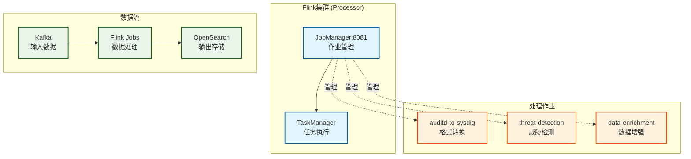

# SysArmor Flink集群测试指南

## 📋 概述

本指南详细介绍如何测试SysArmor系统中的Flink集群（Processor组件），包括作业状态检查、数据流处理测试、auditd到sysdig格式转换验证和性能监控。

## 🏗️ Flink集群架构



## 🚀 前置条件

确保SysArmor系统已正确部署并运行：

```bash
# 检查系统状态
make health

# 确认Flink服务运行
curl http://localhost:8080/api/v1/services/flink/overview
curl http://localhost:8081/overview
```

## 🧪 Flink作业状态检查

### 1. 通过Manager API查看作业
```bash
# 获取Flink集群概览
curl http://localhost:8080/api/v1/services/flink/overview | jq '.'

# 查看所有作业
curl http://localhost:8080/api/v1/services/flink/jobs | jq '.'

# 查看作业概览
curl http://localhost:8080/api/v1/services/flink/jobs/overview | jq '.'

# 查看TaskManager状态
curl http://localhost:8080/api/v1/services/flink/taskmanagers | jq '.'
```

### 2. 直接访问Flink Web UI
```bash
# 打开Flink Web UI
open http://localhost:8081

# 或者使用curl查看
curl http://localhost:8081/overview
curl http://localhost:8081/jobs/overview
```

### 3. 检查集群健康状态
```bash
# 获取集群健康状态
curl http://localhost:8080/api/v1/services/flink/health | jq '.'

# 预期响应示例
{
  "success": true,
  "data": {
    "healthy": true,
    "status": "healthy",
    "cluster_overview": {
      "slots_total": 4,
      "slots_available": 2,
      "jobs_running": 1,
      "jobs_finished": 0,
      "jobs_cancelled": 0,
      "jobs_failed": 0
    },
    "taskmanager_overview": {
      "total_taskmanagers": 1,
      "healthy_taskmanagers": 1,
      "unhealthy_taskmanagers": 0
    }
  }
}
```

## 📊 数据流处理测试

### 1. 准备测试数据

#### 注册测试Collector
```bash
# 注册一个测试Collector
RESPONSE=$(curl -s -X POST http://localhost:8080/api/v1/collectors/register \
  -H "Content-Type: application/json" \
  -d '{
    "hostname": "flink-test-server",
    "ip_address": "192.168.1.100",
    "os_type": "linux",
    "deployment_type": "agentless"
  }')

# 提取collector_id
COLLECTOR_ID=$(echo $RESPONSE | jq -r '.data.collector_id')
echo "测试Collector ID: $COLLECTOR_ID"
```

### 2. 发送测试auditd数据

#### 基础SYSCALL事件
```bash
# 发送SYSCALL类型的auditd事件
echo "{
  \"collector_id\": \"$COLLECTOR_ID\",
  \"timestamp\": \"$(date -u +%Y-%m-%dT%H:%M:%SZ)\",
  \"host\": \"flink-test-server\",
  \"source\": \"auditd\",
  \"message\": \"type=SYSCALL msg=audit($(date +%s).123:456): arch=c000003e syscall=2 success=yes exit=3 a0=7fff1234 a1=241 a2=1b6 a3=0 items=1 ppid=1234 pid=5678 auid=1000 uid=0 gid=0 euid=0 suid=0 fsuid=0 egid=0 sgid=0 fsgid=0 tty=pts0 ses=1 comm=\\\"cat\\\" exe=\\\"/bin/cat\\\" key=\\\"file_access\\\"\",
  \"event_type\": \"audit\",
  \"severity\": \"info\",
  \"tags\": [\"audit\", \"syscall\", \"file_access\"]
}" | nc ${MIDDLEWARE_HOST:-localhost} 6000

echo "✅ 已发送SYSCALL测试数据"
```

#### EXECVE事件 (权限提升检测)
```bash
# 发送EXECVE类型的auditd事件
echo "{
  \"collector_id\": \"$COLLECTOR_ID\",
  \"timestamp\": \"$(date -u +%Y-%m-%dT%H:%M:%SZ)\",
  \"host\": \"flink-test-server\",
  \"source\": \"auditd\",
  \"message\": \"type=EXECVE msg=audit($(date +%s).456:789): argc=3 a0=\\\"sudo\\\" a1=\\\"-u\\\" a2=\\\"root\\\"\",
  \"event_type\": \"audit\",
  \"severity\": \"warning\",
  \"tags\": [\"audit\", \"execve\", \"privilege_escalation\"]
}" | nc ${MIDDLEWARE_HOST:-localhost} 6000

echo "✅ 已发送EXECVE测试数据"
```

#### 文件删除事件
```bash
# 发送文件删除事件
echo "{
  \"collector_id\": \"$COLLECTOR_ID\",
  \"timestamp\": \"$(date -u +%Y-%m-%dT%H:%M:%SZ)\",
  \"host\": \"flink-test-server\",
  \"source\": \"auditd\",
  \"message\": \"type=SYSCALL msg=audit($(date +%s).789:012): arch=c000003e syscall=87 success=yes exit=0 a0=7fff5678 a1=0 a2=0 a3=0 items=2 ppid=2345 pid=6789 auid=1000 uid=1000 gid=1000 euid=1000 suid=1000 fsuid=1000 egid=1000 sgid=1000 fsgid=1000 tty=pts0 ses=1 comm=\\\"rm\\\" exe=\\\"/bin/rm\\\" key=\\\"file_deletion\\\"\",
  \"event_type\": \"audit\",
  \"severity\": \"high\",
  \"tags\": [\"audit\", \"syscall\", \"file_deletion\", \"suspicious\"]
}" | nc ${MIDDLEWARE_HOST:-localhost} 6000

echo "✅ 已发送文件删除测试数据"
```

### 3. 验证数据处理

#### 检查Kafka中的原始数据
```bash
# 等待数据处理
sleep 5

# 检查Kafka主题
echo "📋 检查Kafka主题..."
curl -s "http://localhost:8080/api/v1/services/kafka/topics" | jq '.data.collector_topics'

# 查看特定主题的消息
TOPIC_NAME="sysarmor-agentless-$(echo $COLLECTOR_ID | cut -c1-8)"
echo "📋 查看主题 $TOPIC_NAME 的消息..."
curl -s "http://localhost:8080/api/v1/services/kafka/topics/$TOPIC_NAME/messages?limit=5" | jq '.data'
```

#### 检查Flink作业处理情况
```bash
# 查看作业状态
echo "🔧 检查Flink作业状态..."
curl -s http://localhost:8080/api/v1/services/flink/jobs | jq '.data[] | {name: .name, state: .state, "start-time": ."start-time"}'

# 获取作业ID并查看详细指标
JOB_ID=$(curl -s http://localhost:8080/api/v1/services/flink/jobs | jq -r '.data[0].jid // empty')
if [ ! -z "$JOB_ID" ]; then
  echo "📊 查看作业 $JOB_ID 的指标..."
  curl -s "http://localhost:8080/api/v1/services/flink/jobs/$JOB_ID/metrics" | jq '.data'
fi
```

## 🔄 auditd到sysdig格式转换验证

### 1. 检查转换后的数据
```bash
# 等待Flink处理完成
sleep 10

# 查看OpenSearch中的处理结果
echo "🔍 检查OpenSearch中的转换结果..."
curl -s "http://localhost:8080/api/v1/services/opensearch/events/recent?hours=1&size=10" | jq '.data.hits.hits[] | ._source | {timestamp, evt_type, proc_name, proc_cmdline, user_name}'
```

### 2. 验证sysdig格式字段
```bash
# 搜索包含sudo的事件 (验证EXECVE转换)
echo "🔍 搜索sudo相关事件..."
curl -s "http://localhost:8080/api/v1/services/opensearch/events/search?q=sudo&size=5" | jq '.data.hits.hits[] | ._source | {
  timestamp,
  evt_type,
  evt_category,
  proc_name,
  proc_cmdline,
  user_name,
  container_id,
  k8s_pod_name
}'

# 搜索文件删除事件
echo "🔍 搜索文件删除事件..."
curl -s "http://localhost:8080/api/v1/services/opensearch/events/search?q=file_deletion&size=5" | jq '.data.hits.hits[] | ._source | {
  timestamp,
  evt_type,
  evt_category,
  fd_name,
  proc_name,
  user_name
}'
```

### 3. 验证威胁检测结果
```bash
# 查看威胁事件
echo "🚨 检查威胁检测结果..."
curl -s "http://localhost:8080/api/v1/services/opensearch/events/threats?size=5" | jq '.data.hits.hits[] | ._source | {
  timestamp,
  threat_type,
  risk_score,
  severity,
  proc_name,
  user_name,
  description
}'

# 查看高风险事件
echo "🚨 检查高风险事件..."
curl -s "http://localhost:8080/api/v1/services/opensearch/events/high-risk?min_score=70&size=5" | jq '.data.hits.hits[] | ._source | {
  timestamp,
  risk_score,
  severity,
  evt_type,
  proc_name,
  threat_indicators
}'
```

## 📈 性能监控和指标

### 1. Flink集群性能监控
```bash
# 查看TaskManager详细状态
echo "📊 TaskManager性能监控..."
curl -s http://localhost:8080/api/v1/services/flink/taskmanagers | jq '.data[] | {
  id,
  path,
  dataPort,
  timeSinceLastHeartbeat,
  slotsNumber,
  freeSlots,
  hardware: {
    cpuCores: .hardware.cpuCores,
    physicalMemory: .hardware.physicalMemory,
    freeMemory: .hardware.freeMemory,
    managedMemory: .hardware.managedMemory
  }
}'

# 查看TaskManager概览
curl -s http://localhost:8080/api/v1/services/flink/taskmanagers/overview | jq '.data'
```

### 2. 作业性能指标
```bash
# 获取所有作业的性能指标
echo "📊 作业性能指标..."
for job_id in $(curl -s http://localhost:8080/api/v1/services/flink/jobs | jq -r '.data[].jid'); do
  echo "作业 $job_id 的指标:"
  curl -s "http://localhost:8080/api/v1/services/flink/jobs/$job_id/metrics" | jq '.data | {
    "records-consumed": ."records-consumed-rate",
    "records-produced": ."records-produced-rate",
    "bytes-consumed": ."bytes-consumed-rate",
    "bytes-produced": ."bytes-produced-rate",
    "latency": .latency,
    "backpressure": .backpressure
  }'
done
```

### 3. 容器资源监控
```bash
# 监控Flink容器资源使用
echo "💻 容器资源监控..."
docker stats --no-stream --format "table {{.Name}}\t{{.CPUPerc}}\t{{.MemUsage}}\t{{.NetIO}}\t{{.BlockIO}}" processor-jobmanager processor-taskmanager

# 查看容器日志 (最近100行)
echo "📋 JobManager日志..."
docker logs --tail 100 processor-jobmanager

echo "📋 TaskManager日志..."
docker logs --tail 100 processor-taskmanager
```

## 🧪 高级测试场景

### 1. 批量数据处理测试
```bash
# 批量发送测试数据
echo "🚀 批量数据处理测试..."
for i in {1..50}; do
  echo "{
    \"collector_id\": \"$COLLECTOR_ID\",
    \"timestamp\": \"$(date -u +%Y-%m-%dT%H:%M:%SZ)\",
    \"host\": \"flink-test-server\",
    \"source\": \"auditd\",
    \"message\": \"type=SYSCALL msg=audit($(date +%s).$i:$((i+1000))): arch=c000003e syscall=$((i%10+1)) success=yes exit=0 pid=$((1000+i)) comm=\\\"test$i\\\" exe=\\\"/bin/test$i\\\"\",
    \"event_type\": \"audit\",
    \"severity\": \"info\",
    \"tags\": [\"audit\", \"syscall\", \"batch_test\"]
  }" | nc ${MIDDLEWARE_HOST:-localhost} 6000
  
  # 每10个事件暂停一下
  if [ $((i % 10)) -eq 0 ]; then
    sleep 1
    echo "已发送 $i 个事件..."
  fi
done

echo "✅ 批量测试数据发送完成"
```

### 2. 性能压力测试
```bash
# 等待处理完成
sleep 30

# 检查处理性能
echo "📊 性能压力测试结果..."
curl -s "http://localhost:8080/api/v1/services/opensearch/events/aggregations" | jq '.data.aggregations.events_per_minute'

# 检查Flink作业吞吐量
for job_id in $(curl -s http://localhost:8080/api/v1/services/flink/jobs | jq -r '.data[].jid'); do
  echo "作业 $job_id 吞吐量:"
  curl -s "http://localhost:8080/api/v1/services/flink/jobs/$job_id/metrics" | jq '.data | {
    "输入速率": ."records-consumed-rate",
    "输出速率": ."records-produced-rate",
    "处理延迟": .latency
  }'
done
```

### 3. 故障恢复测试
```bash
# 重启TaskManager测试故障恢复
echo "🔄 故障恢复测试..."
docker restart processor-taskmanager

# 等待恢复
sleep 10

# 检查集群状态
curl -s http://localhost:8080/api/v1/services/flink/health | jq '.data.healthy'

# 检查作业是否自动恢复
curl -s http://localhost:8080/api/v1/services/flink/jobs | jq '.data[] | {name: .name, state: .state}'
```

## 🚨 故障排查

### 1. 作业失败排查
```bash
# 检查失败的作业
echo "🔍 检查失败作业..."
curl -s http://localhost:8080/api/v1/services/flink/jobs | jq '.data[] | select(.state == "FAILED") | {name, state, "start-time", "end-time"}'

# 查看作业异常信息
for job_id in $(curl -s http://localhost:8080/api/v1/services/flink/jobs | jq -r '.data[] | select(.state == "FAILED") | .jid'); do
  echo "作业 $job_id 异常信息:"
  curl -s "http://localhost:8081/jobs/$job_id/exceptions" | jq '.["root-exception"]'
done
```

### 2. 性能问题排查
```bash
# 检查背压情况
echo "📊 检查背压情况..."
for job_id in $(curl -s http://localhost:8080/api/v1/services/flink/jobs | jq -r '.data[].jid'); do
  echo "作业 $job_id 背压状态:"
  curl -s "http://localhost:8081/jobs/$job_id/vertices" | jq '.vertices[] | {name, backpressure}'
done

# 检查检查点状态
echo "💾 检查检查点状态..."
for job_id in $(curl -s http://localhost:8080/api/v1/services/flink/jobs | jq -r '.data[].jid'); do
  echo "作业 $job_id 检查点:"
  curl -s "http://localhost:8081/jobs/$job_id/checkpoints" | jq '.latest'
done
```

### 3. 资源使用排查
```bash
# 检查内存使用
echo "💾 内存使用情况..."
curl -s http://localhost:8080/api/v1/services/flink/taskmanagers | jq '.data[] | {
  id,
  "内存总量": .hardware.physicalMemory,
  "空闲内存": .hardware.freeMemory,
  "托管内存": .hardware.managedMemory
}'

# 检查CPU使用
echo "🖥️ CPU使用情况..."
docker stats --no-stream processor-jobmanager processor-taskmanager
```

## 📚 测试结果分析

### 1. 数据处理验证清单
- [ ] **Kafka消息接收**: 原始auditd数据正确进入Kafka
- [ ] **Flink作业运行**: 所有处理作业状态为RUNNING
- [ ] **格式转换**: auditd成功转换为sysdig格式
- [ ] **威胁检测**: 高风险事件被正确识别
- [ ] **数据存储**: 处理后数据正确存入OpenSearch
- [ ] **性能指标**: 处理延迟和吞吐量在合理范围内

### 2. 性能基准
- **处理延迟**: < 100ms (端到端)
- **吞吐量**: > 1000 events/sec
- **内存使用**: < 2GB (JobManager + TaskManager)
- **CPU使用**: < 50% (正常负载)

### 3. 故障恢复验证
- **作业重启**: 作业失败后自动重启
- **检查点恢复**: 从最近检查点恢复状态
- **数据一致性**: 故障恢复后数据不丢失

## 📖 相关资源

### 配置文件
- `services/processor/configs/` - Flink作业配置
- `services/processor/jobs/` - 作业实现代码

### 相关文档
- [分布式部署指南](distributed-deployment-guide.md) - 系统部署方案
- [SysArmor主文档](../../README.md) - 系统概述
- [Manager API参考手册](../manager-api-reference.md) - API接口文档

### 外部资源
- [Apache Flink文档](https://flink.apache.org/docs/) - Flink官方文档
- [Flink监控指南](https://flink.apache.org/docs/stable/ops/monitoring/) - 监控最佳实践

---

**SysArmor Flink集群测试指南** - 完整的数据处理测试方案  
**最后更新**: 2025-09-05  
**适用版本**: v1.0.0+  
**测试覆盖**: 数据流处理 + 格式转换 + 威胁检测 ✅
