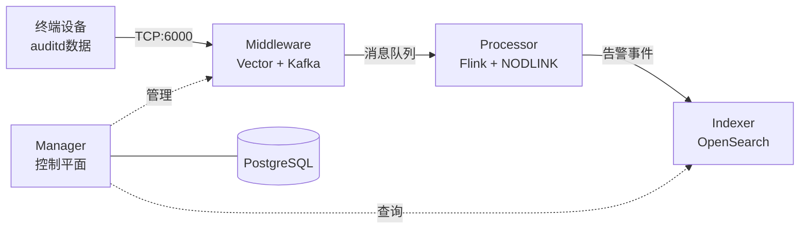

# SysArmor 架构与部署

## 🏗️ 系统架构

SysArmor 采用微服务架构，由四大核心模块组成：



### 核心模块
- **Manager**: Go + PostgreSQL，设备管理和API网关 (8080)
- **Middleware**: Vector + Kafka + Prometheus，数据收集和路由 (6000/9094/9090)
- **Processor**: Flink + NODLINK，实时流处理和威胁检测 (8081)
- **Indexer**: OpenSearch，告警存储和查询 (9200)

### 数据流架构
```
原始数据层: sysarmor.raw.audit (auditd原始数据)
处理事件层: sysarmor.events.audit (结构化事件)
告警事件层: sysarmor.alerts (威胁告警)
```

## 🚀 部署方案

### 方案1: 单机部署
**适用**: 开发测试、小规模生产  
**配置**: `docker-compose.yml` + `.env`

```bash
# 快速部署
cp .env.example .env
make deploy

# 验证部署
make health
curl http://localhost:8080/swagger/index.html
```

### 方案2: 分布式部署
**适用**: 大规模生产环境  
**架构**: Middleware远程 + Manager本地

```bash
# 1. 远程服务器部署Middleware
cp .env.example .env.middleware
# 设置 MIDDLEWARE_HOST=远程IP
make up-middleware

# 2. 本地环境部署其他服务
cp .env.example .env.dev  
# 设置 MIDDLEWARE_HOST=远程IP
make up-dev
```

## 📊 服务端口

### 单机部署端口
| 服务 | 端口 | 用途 |
|------|------|------|
| Manager | 8080 | API服务 |
| Vector | 6000 | 数据收集 |
| Kafka | 9094 | 消息队列 |
| Flink | 8081 | 流处理监控 |
| OpenSearch | 9200 | 搜索引擎 |
| Prometheus | 9090 | 监控指标 |

### 分布式部署端口
**远程服务器**: 6000 (Vector), 9094 (Kafka), 9090 (Prometheus)  
**本地环境**: 8080 (Manager), 8081 (Flink), 9200 (OpenSearch)

## 🔄 NODLINK 数据处理

### 支持事件类型 (22种)
- **文件**: read, write, open, openat, chmod, rename, rmdir
- **进程**: execve, fork, clone, pipe  
- **网络**: socket, connect, accept, sendto, recvfrom
- **其他**: fcntl, readv, writev, send, sendmsg, recvmsg

### 处理特性
- **实时解析**: auditd日志实时解析
- **进程树重建**: 60秒时间窗口父进程重建
- **网络解析**: IPv4/IPv6地址端口解析
- **命令行解码**: 十六进制编码解码

## ✅ 验证和测试

### 部署验证
```bash
# 系统健康检查
./tests/test-system-health.sh

# 数据流测试
./tests/test-kafka-producer.sh sysarmor-agentless-samples.jsonl
./tests/test-flink-processor.sh

# 查看处理结果
./scripts/kafka-tools.sh export sysarmor.events.audit 10
```

### 预期结果
- **系统健康**: 19/20 测试通过
- **数据处理**: 1000条原始 → 16条结构化事件
- **Flink集群**: 8槽位，4GB内存配置

## 🔧 故障排除

### 常见问题
- **Manager异常**: `docker compose restart manager`
- **数据库连接**: 容器启动时序问题，重启即可
- **Kafka连接**: 检查 `MIDDLEWARE_HOST` 配置
- **网络问题**: 确保防火墙端口开放

### 性能调优
- **Flink**: 8槽位，4GB内存 (已优化)
- **Kafka**: 137个分区，1个副本
- **系统要求**: 4核CPU，16GB内存

---

**SysArmor 架构与部署** - 完整的系统设计和部署方案
