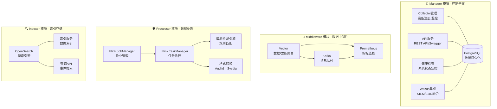

# SysArmor EDR/HIDS 系统 API 参考手册

## 📋 概述

SysArmor 是一个现代化的端点检测与响应(EDR/HIDS)系统，采用微服务架构，提供完整的RESTful API接口。本手册涵盖所有API端点的详细说明、请求/响应格式、错误处理和使用示例。

## 🌐 基础信息

- **Base URL**: `http://localhost:8080/api/v1`
- **API版本**: v1.0
- **认证方式**: API Key / Bearer Token
- **响应格式**: JSON
- **API文档**: http://localhost:8080/swagger/index.html

## 🏗️ 系统架构



## 📚 API 分类

### 1. 🖥️ Collector 管理 API
管理终端设备的数据收集器，支持agentless部署。

### 2. 🏥 健康检查 API
监控系统各组件的健康状态和性能指标。

### 3. 📊 事件查询 API
查询和分析安全事件数据。

### 4. 🔧 服务管理 API
管理Kafka、Flink、OpenSearch等核心服务。

### 5. 🛡️ Wazuh 集成 API
完整的Wazuh Manager和Indexer集成。

### 6. 📁 资源管理 API
管理脚本、配置文件和二进制资源。

---

## 🖥️ Collector 管理 API

### 注册新的 Collector
```http
POST /api/v1/collectors/register
Content-Type: application/json

{
  "hostname": "web-server-01",
  "ip_address": "192.168.1.100",
  "os_type": "linux",
  "os_version": "Ubuntu 20.04",
  "deployment_type": "agentless",
  "metadata": {
    "environment": "production",
    "group": "web-servers",
    "owner": "devops-team",
    "tags": ["web", "nginx", "critical"]
  }
}
```

**响应示例**:
```json
{
  "success": true,
  "data": {
    "collector_id": "abc123-def456-ghi789",
    "worker_url": "http://middleware-vector:6000",
    "script_download_url": "/api/v1/scripts/setup-terminal.sh?collector_id=abc123"
  }
}
```

### 获取 Collector 列表
```http
GET /api/v1/collectors?page=1&limit=20&status=active&environment=production
```

**响应示例**:
```json
{
  "success": true,
  "data": {
    "collectors": [
      {
        "collector_id": "abc123-def456-ghi789",
        "status": "active",
        "hostname": "web-server-01",
        "ip_address": "192.168.1.100",
        "worker_address": "http://middleware-vector:6000",
        "kafka_topic": "sysarmor-agentless-abc123",
        "last_heartbeat": "2025-09-04T15:30:00Z",
        "realtime_status": "online",
        "last_seen_minutes": 2,
        "metadata": {
          "environment": "production",
          "group": "web-servers"
        }
      }
    ],
    "total": 1,
    "page": 1,
    "limit": 20
  }
}
```

### 获取 Collector 状态
```http
GET /api/v1/collectors/{id}
```

### 心跳管理
```http
POST /api/v1/collectors/{id}/heartbeat
Content-Type: application/json

{
  "status": "running",
  "timestamp": "2025-09-04T15:30:00Z"
}
```

### 删除 Collector
```http
DELETE /api/v1/collectors/{id}?force=true
```

---

## 🏥 健康检查 API

### 系统健康概览
```http
GET /api/v1/health/overview
```

**响应示例**:
```json
{
  "success": true,
  "data": {
    "healthy": true,
    "status": "healthy",
    "summary": {
      "total_workers": 3,
      "healthy_workers": 3,
      "total_components": 12,
      "healthy_components": 12
    },
    "components": {
      "database": {
        "healthy": true,
        "status": "connected",
        "response_time": "2ms"
      },
      "kafka": {
        "healthy": true,
        "status": "online",
        "response_time": "15ms"
      }
    },
    "workers": [
      {
        "name": "middleware-vector",
        "healthy": true,
        "response_time": "25ms"
      }
    ]
  }
}
```

### 综合健康检查
```http
GET /api/v1/health/comprehensive
```

### Worker 状态
```http
GET /api/v1/health/workers
GET /api/v1/health/workers/{name}
GET /api/v1/health/workers/{name}/metrics
```

---

## 📊 事件查询 API

### 查询事件
```http
GET /api/v1/events/query?topic=sysarmor-agentless-abc123&limit=100&latest=true
```

**响应示例**:
```json
{
  "success": true,
  "data": {
    "events": [
      {
        "timestamp": "2025-09-04T15:30:00Z",
        "collector_id": "abc123-def456-ghi789",
        "event_type": "process_execution",
        "severity": "medium",
        "data": {
          "process_name": "nginx",
          "command_line": "/usr/sbin/nginx -g daemon off;",
          "user": "www-data",
          "pid": 1234
        }
      }
    ],
    "total": 1,
    "topic": "sysarmor-agentless-abc123"
  }
}
```

### 按 Collector 查询事件
```http
GET /api/v1/events/collectors/{collector_id}?from_time=2025-09-04T00:00:00Z&to_time=2025-09-04T23:59:59Z
```

### 获取 Kafka Topics
```http
GET /api/v1/events/topics
```

---

## 🔧 服务管理 API

### Kafka 管理

#### 测试连接
```http
GET /api/v1/services/kafka/test-connection
```

#### 集群信息
```http
GET /api/v1/services/kafka/clusters
```

#### Topic 管理
```http
GET /api/v1/services/kafka/topics?page=1&limit=20&search=sysarmor
POST /api/v1/services/kafka/topics
DELETE /api/v1/services/kafka/topics/{topic}
```

**创建 Topic 示例**:
```json
{
  "name": "sysarmor-custom-events",
  "partitions": 3,
  "replication_factor": 1,
  "config": {
    "retention.ms": "604800000",
    "cleanup.policy": "delete"
  }
}
```

#### Broker 管理
```http
GET /api/v1/services/kafka/brokers
GET /api/v1/services/kafka/brokers/overview
```

#### Consumer Group 管理
```http
GET /api/v1/services/kafka/consumer-groups
GET /api/v1/services/kafka/consumer-groups/{group}
```

### Flink 管理

#### 集群概览
```http
GET /api/v1/services/flink/overview
```

**响应示例**:
```json
{
  "success": true,
  "data": {
    "taskmanagers": 2,
    "slots-total": 4,
    "slots-available": 2,
    "jobs-running": 1,
    "flink-version": "1.18.1"
  }
}
```

#### 作业管理
```http
GET /api/v1/services/flink/jobs
GET /api/v1/services/flink/jobs/{job_id}
GET /api/v1/services/flink/jobs/{job_id}/metrics
```

#### TaskManager 管理
```http
GET /api/v1/services/flink/taskmanagers
GET /api/v1/services/flink/taskmanagers/overview
```

### OpenSearch 管理

#### 集群健康
```http
GET /api/v1/services/opensearch/cluster/health
```

#### 索引管理
```http
GET /api/v1/services/opensearch/indices
```

#### 事件搜索
```http
GET /api/v1/services/opensearch/events/search?q=process_execution&size=50
GET /api/v1/services/opensearch/events/recent?hours=24
GET /api/v1/services/opensearch/events/high-risk?min_score=80
```

---

## 🛡️ Wazuh 集成 API

### 配置管理

#### 获取配置
```http
GET /api/v1/wazuh/config
```

**响应示例**:
```json
{
  "success": true,
  "data": {
    "status": "active",
    "manager": {
      "host": "wazuh-manager",
      "port": 55000,
      "tls": true,
      "connected": true
    },
    "indexer": {
      "host": "wazuh-indexer",
      "port": 9200,
      "tls": true,
      "connected": true
    }
  }
}
```

#### 更新配置
```http
PUT /api/v1/wazuh/config
Content-Type: application/json

{
  "manager": {
    "host": "new-wazuh-manager",
    "port": 55000,
    "username": "admin",
    "password": "new-password",
    "tls": true,
    "tls_verify": false
  },
  "indexer": {
    "host": "new-wazuh-indexer",
    "port": 9200,
    "username": "admin",
    "password": "admin"
  }
}
```

### Manager API

#### Manager 信息
```http
GET /api/v1/wazuh/manager/info
GET /api/v1/wazuh/manager/status
```

#### Agent 管理
```http
GET /api/v1/wazuh/agents?offset=0&limit=100&status=active&search=web
POST /api/v1/wazuh/agents
GET /api/v1/wazuh/agents/{id}
DELETE /api/v1/wazuh/agents/{id}
```

**添加 Agent 示例**:
```json
{
  "name": "web-server-01",
  "ip": "192.168.1.100",
  "groups": ["web-servers"],
  "force": {
    "enabled": true,
    "disconnected_time": {
      "enabled": true,
      "value": "10m"
    }
  }
}
```

#### 组管理
```http
GET /api/v1/wazuh/groups
POST /api/v1/wazuh/groups
GET /api/v1/wazuh/groups/{name}/agents
POST /api/v1/wazuh/groups/{name}/agents
```

### Indexer API

#### 健康检查
```http
GET /api/v1/wazuh/indexer/health
```

#### 索引管理
```http
GET /api/v1/wazuh/indexer/indices?pattern=wazuh-alerts-*
POST /api/v1/wazuh/indexer/indices
DELETE /api/v1/wazuh/indexer/indices/{name}
```

#### 告警搜索
```http
POST /api/v1/wazuh/alerts/search
Content-Type: application/json

{
  "index": "wazuh-alerts-*",
  "query": {
    "bool": {
      "must": [
        {
          "range": {
            "timestamp": {
              "gte": "2025-09-04T00:00:00Z",
              "lte": "2025-09-04T23:59:59Z"
            }
          }
        },
        {
          "term": {
            "rule.level": 10
          }
        }
      ]
    }
  },
  "size": 100,
  "sort": [
    {
      "timestamp": {
        "order": "desc"
      }
    }
  ]
}
```

---

## 📁 资源管理 API

### 脚本资源
```http
GET /api/v1/resources/scripts/{deployment_type}/{script_name}?collector_id={id}
```

**支持的脚本类型**:
- `agentless/setup-terminal.sh` - Agentless安装脚本
- `agentless/uninstall-terminal.sh` - Agentless卸载脚本
- `sysarmor-stack/install-collector.sh` - SysArmor收集器安装
- `wazuh-hybrid/install-wazuh.sh` - Wazuh混合部署

### 配置资源
```http
GET /api/v1/resources/configs/{deployment_type}/{config_name}?collector_id={id}
```

### 二进制资源
```http
GET /api/v1/resources/binaries/{filename}
```

---

## 🔐 认证和安全

### API Key 认证
```http
GET /api/v1/collectors
X-API-Key: your-api-key-here
```

### Bearer Token 认证
```http
GET /api/v1/wazuh/agents
Authorization: Bearer your-jwt-token-here
```

### TLS 配置
所有API支持HTTPS，推荐在生产环境中启用：
```bash
# 启用TLS
export MANAGER_TLS_ENABLED=true
export MANAGER_TLS_CERT_PATH=/path/to/cert.pem
export MANAGER_TLS_KEY_PATH=/path/to/key.pem
```

---

## 📋 标准响应格式

### 成功响应
```json
{
  "success": true,
  "data": {
    // 响应数据
  },
  "message": "Operation completed successfully"
}
```

### 错误响应
```json
{
  "success": false,
  "error": "Human readable error message",
  "code": "MACHINE_READABLE_CODE",
  "message": "User-friendly guidance message"
}
```

### HTTP 状态码

| 状态码 | 含义 | 使用场景 |
|--------|------|----------|
| 200 | OK | 请求成功 |
| 201 | Created | 资源创建成功 |
| 400 | Bad Request | 请求参数错误 |
| 401 | Unauthorized | 认证失败 |
| 404 | Not Found | 资源不存在 |
| 408 | Request Timeout | 请求超时 |
| 409 | Conflict | 资源冲突 |
| 501 | Not Implemented | 功能未实现 |
| 503 | Service Unavailable | 服务不可用 |
| 500 | Internal Server Error | 内部错误 |

---

## 🔍 查询参数

### 分页参数
- `page` - 页码，默认1
- `limit` - 每页数量，默认20，最大100
- `offset` - 偏移量，用于某些API

### 过滤参数
- `status` - 按状态过滤
- `search` - 搜索关键词
- `sort` - 排序字段
- `order` - 排序方向 (asc/desc)

### 时间参数
- `from_time` - 开始时间 (RFC3339格式)
- `to_time` - 结束时间 (RFC3339格式)
- `hours` - 时间范围（小时）

---

## 🚨 错误处理

### Wazuh 服务错误
当Wazuh服务未启用时：
```json
{
  "success": false,
  "error": "Wazuh service is currently disabled",
  "code": "SERVICE_DISABLED",
  "message": "Please configure and enable Wazuh integration first"
}
HTTP Status: 503
```

### 资源不存在错误
```json
{
  "success": false,
  "error": "Collector not found",
  "code": "NOT_FOUND"
}
HTTP Status: 404
```

### 功能未实现错误
```json
{
  "success": false,
  "error": "Rule creation requires file upload, not yet implemented",
  "code": "NOT_IMPLEMENTED",
  "message": "This feature is planned for future releases"
}
HTTP Status: 501
```

---

## 🛠️ 开发工具

### Swagger UI
访问完整的交互式API文档：
```
http://localhost:8080/swagger/index.html
```

### API 测试
```bash
# 健康检查
curl http://localhost:8080/health

# 获取Collector列表
curl -H "Accept: application/json" \
     http://localhost:8080/api/v1/collectors

# 测试Wazuh配置
curl -H "Accept: application/json" \
     http://localhost:8080/api/v1/wazuh/config
```

### 生成API文档
```bash
# 生成Swagger文档
make docs-swagger

# 构建并部署
make build-manager
make deploy
```

---

## 📈 性能指标

### API 响应时间
| API类型 | 平均响应时间 | 说明 |
|---------|-------------|------|
| 健康检查 | < 10ms | 内存读取 |
| Collector查询 | < 50ms | 数据库查询 |
| 事件查询 | < 200ms | OpenSearch查询 |
| Kafka操作 | < 100ms | 集群操作 |
| Wazuh API | < 300ms | 外部API调用 |

### 并发支持
- **最大并发**: 1000+ 请求/秒
- **连接池**: 100个连接
- **超时设置**: 30秒默认超时

---

## 🔧 配置管理

### 环境变量
```bash
# Manager服务
MANAGER_HOST=manager
MANAGER_PORT=8080
MANAGER_LOG_LEVEL=info

# Wazuh集成
WAZUH_ENABLED=true
WAZUH_MANAGER_HOST=wazuh-manager
WAZUH_MANAGER_PORT=55000
WAZUH_MANAGER_USERNAME=wazuh
WAZUH_MANAGER_PASSWORD=wazuh
WAZUH_INDEXER_HOST=wazuh-indexer
WAZUH_INDEXER_PORT=9200

# 数据库
POSTGRES_DB=sysarmor
POSTGRES_USER=sysarmor
POSTGRES_PASSWORD=password

# Kafka
KAFKA_BOOTSTRAP_SERVERS=middleware-kafka:9092

# OpenSearch
OPENSEARCH_URL=http://indexer-opensearch:9200
OPENSEARCH_USERNAME=admin
OPENSEARCH_PASSWORD=admin
```

### 配置文件
- `shared/templates/configs/wazuh.yaml` - Wazuh集成配置模板
- `.env` - 环境变量配置
- `docker-compose.yml` - 服务编排配置

---

## 🧪 测试和验证

### 自动化测试
```bash
# 运行所有测试
make test

# 运行Manager测试
make test-manager

# 运行Wazuh集成测试
./tests/test-hfw-wazuh-integration.sh
```

### 手动测试
```bash
# 1. 启动系统
make up

# 2. 健康检查
make health

# 3. 注册Collector
curl -X POST http://localhost:8080/api/v1/collectors/register \
  -H "Content-Type: application/json" \
  -d '{
    "hostname": "test-server",
    "ip_address": "192.168.1.100",
    "os_type": "linux",
    "os_version": "Ubuntu 20.04",
    "deployment_type": "agentless"
  }'

# 4. 下载安装脚本
curl "http://localhost:8080/api/v1/resources/scripts/agentless/setup-terminal.sh?collector_id=YOUR_ID" -o install.sh
```

---

## 📚 相关文档

### 核心文档
- [系统架构说明](../README.md)
- [API参考文档](manager-api-reference.md)
- [v0.1功能特性](v0.1-release-features.md)

### 迁移文档
- [HFW分支迁移完成](migrations/HFW_MIGRATION_COMPLETE.md)
- [Nova分支迁移完成](migrations/NOVA_MIGRATION_COMPLETE.md)
- [Dev-Zheng分支迁移完成](migrations/DEV_ZHENG_MIGRATION_COMPLETE.md)

### 集成指南
- [Auditd转换集成指南](auditd-to-sysdig-integration-guide.md)
- [Wazuh集成测试脚本](../tests/test-hfw-wazuh-integration.sh)

---

## 🚀 快速开始

### 1. 系统部署
```bash
git clone https://github.com/sysarmor/sysarmor-stack.git
cd sysarmor-stack/sysarmor
make up
```

### 2. 验证部署
```bash
make health
curl http://localhost:8080/health
```

### 3. 访问API文档
```
http://localhost:8080/swagger/index.html
```

### 4. 注册第一个设备
```bash
curl -X POST http://localhost:8080/api/v1/collectors/register \
  -H "Content-Type: application/json" \
  -d '{
    "hostname": "my-server",
    "ip_address": "192.168.1.100",
    "os_type": "linux",
    "os_version": "Ubuntu 20.04",
    "deployment_type": "agentless"
  }'
```

---

## 🔗 相关链接

- **项目主页**: https://github.com/sysarmor/sysarmor-stack
- **API文档**: http://localhost:8080/swagger/index.html
- **监控面板**: http://localhost:9090 (Prometheus)
- **搜索引擎**: http://localhost:9200 (OpenSearch)
- **流处理**: http://localhost:8081 (Flink)

---

**SysArmor EDR/HIDS API 参考手册** - 版本 1.0  
**最后更新**: 2025-09-04  
**文档状态**: 生产就绪 ✅
