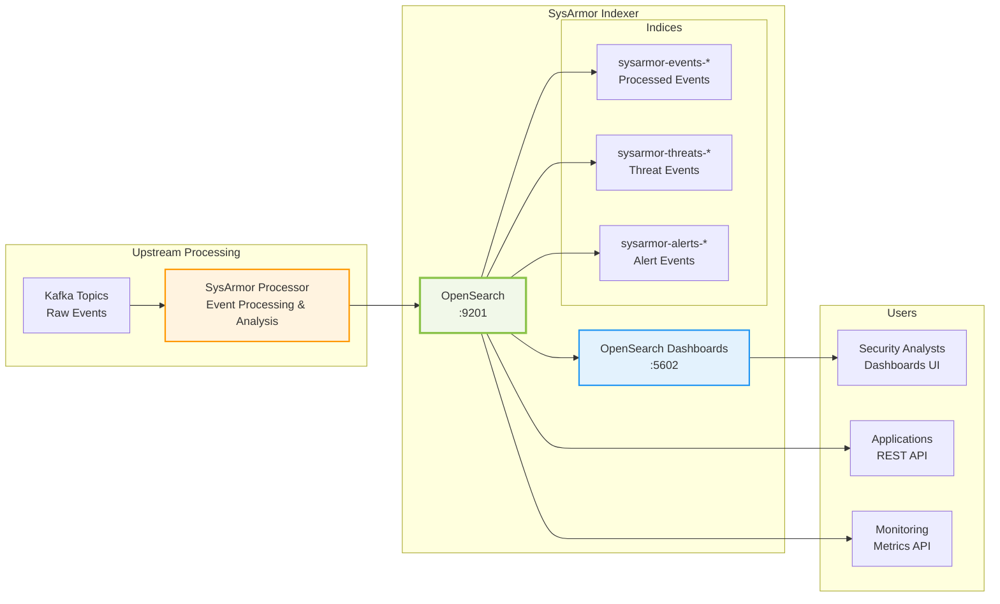

# SysArmor Indexer

基于 OpenSearch 的安全事件索引和搜索服务，为 SysArmor EDR 系统提供高性能的事件存储、索引和分析能力。

## 🎯 核心功能

- **高性能索引**: 基于 OpenSearch 2.11.0 的分布式搜索引擎
- **安全认证**: 内置用户管理和角色权限控制
- **可视化分析**: OpenSearch Dashboards 提供丰富的数据可视化
- **容器化部署**: Docker Compose 一键部署
- **监控告警**: 内置健康检查和性能监控

## 🏗️ 架构设计



## 🚀 快速开始

### 1. 启动服务

```bash
# 生成 SSL 证书并启动
make setup up
```

### 2. 验证部署

```bash
# 健康检查
make health

# 应用索引模板
make templates
```

### 3. 访问服务

- **OpenSearch API**: http://localhost:9201
- **OpenSearch Dashboards**: http://localhost:5602
- **默认账户**: admin/admin

## 📊 服务访问

| 服务 | 地址 | 用户名 | 密码 | 描述 |
|------|------|--------|------|------|
| OpenSearch API | http://localhost:9201 | admin | admin | 搜索引擎 API |
| OpenSearch Dashboards | http://localhost:5602 | admin | admin | 数据可视化界面 |

## 👥 用户账户

| 用户名 | 密码 | 角色 | 用途 |
|--------|------|------|------|
| admin | admin | 管理员 | 完全管理权限 |
| sysarmor_etl | sysarmor_etl | 写入用户 | 数据写入专用 |
| sysarmor_reader | sysarmor_reader | 只读用户 | 数据查询和分析 |
| sysarmor_monitor | sysarmor_monitor | 监控用户 | 系统监控 |

## 🛠️ 管理命令

### 基础操作

```bash
# 启动服务
make up

# 停止服务
make down

# 重启服务
make restart

# 查看状态
make status

# 健康检查
make health

# 查看日志
make logs
```

### 数据管理

```bash
# 应用索引模板
make templates

# 列出所有索引
make indices

# 搜索最近事件
make search

# 测试数据摄取
make test-ingest
```

### 系统管理

```bash
# 列出所有用户
make users

# 创建数据备份
make backup

# 查看集群性能
make monitor

# 清理容器和数据
make clean
```

## 📋 索引模板

### 事件索引模板

```json
{
  "index_patterns": ["sysarmor-events-*"],
  "template": {
    "settings": {
      "number_of_shards": 1,
      "number_of_replicas": 0,
      "refresh_interval": "5s"
    },
    "mappings": {
      "properties": {
        "@timestamp": {"type": "date"},
        "collector_id": {"type": "keyword"},
        "host": {"type": "keyword"},
        "event_type": {"type": "keyword"},
        "message": {"type": "text"},
        "risk_score": {"type": "integer"}
      }
    }
  }
}
```

## 🔍 数据查询

### 基本搜索

```bash
# 搜索最近1小时的事件
curl -u admin:admin -X GET "http://localhost:9201/sysarmor-events-*/_search?pretty" \
  -H "Content-Type: application/json" \
  -d '{
    "query": {
      "range": {
        "@timestamp": {
          "gte": "now-1h"
        }
      }
    },
    "size": 10,
    "sort": [{"@timestamp": {"order": "desc"}}]
  }'
```

### 高风险事件查询

```bash
# 查询高风险事件
curl -u admin:admin -X GET "http://localhost:9201/sysarmor-threats-*/_search?pretty" \
  -H "Content-Type: application/json" \
  -d '{
    "query": {
      "bool": {
        "must": [
          {"range": {"risk_score": {"gte": 70}}},
          {"range": {"@timestamp": {"gte": "now-24h"}}}
        ]
      }
    }
  }'
```

### 按 Collector 查询

```bash
# 查询特定 Collector 的事件
curl -u admin:admin -X GET "http://localhost:9201/sysarmor-events-*/_search?pretty" \
  -H "Content-Type: application/json" \
  -d '{
    "query": {
      "term": {
        "collector_id": "558c01dd-b545-41cb-ab17-0d4290615006"
      }
    }
  }'
```

## 📈 监控指标

### 集群健康状态

```bash
# 集群健康状态
curl -u admin:admin "http://localhost:9201/_cluster/health?pretty"

# 节点信息
curl -u admin:admin "http://localhost:9201/_nodes/stats?pretty"

# 索引统计
curl -u admin:admin "http://localhost:9201/_cat/indices?v"
```

### 性能监控

```bash
# 集群统计
make monitor

# 查看索引大小
curl -u admin:admin "http://localhost:9201/_cat/indices?v&s=store.size:desc"
```

## 🔒 安全配置

### SSL/TLS 配置

- 传输层加密：节点间通信使用 SSL
- HTTP 层：当前为 HTTP（可配置 HTTPS）
- 证书管理：自动生成的 CA 和节点证书

### 用户权限

- **admin**: 完全管理权限
- **sysarmor_etl**: 仅可写入事件索引
- **sysarmor_reader**: 仅可读取事件数据
- **sysarmor_monitor**: 系统监控权限

## 🔧 故障排除

### 常见问题

1. **内存不足**
   ```bash
   # 检查容器内存使用
   docker stats
   
   # 调整 JVM 堆内存（在 docker-compose.yml 中）
   - "OPENSEARCH_JAVA_OPTS=-Xms2g -Xmx2g"
   ```

2. **磁盘空间不足**
   ```bash
   # 检查磁盘使用
   df -h
   
   # 清理旧索引
   curl -u admin:admin -X DELETE "http://localhost:9201/sysarmor-events-2025.07.*"
   ```

3. **服务启动失败**
   ```bash
   # 查看服务日志
   make logs-opensearch
   
   # 检查证书权限
   ls -la config/certs/
   ```

4. **索引模板未应用**
   ```bash
   # 重新应用模板
   make templates
   
   # 检查模板状态
   curl -u admin:admin "http://localhost:9201/_index_template/sysarmor-events"
   ```

## 📚 高级配置

### 性能调优

1. **JVM 堆内存**: 建议设置为系统内存的 50%，最大不超过 32GB
2. **分片配置**: 单节点建议使用 1 个分片，0 个副本
3. **刷新间隔**: 默认 5 秒，可根据实时性需求调整

### 索引生命周期管理

```bash
# 创建索引生命周期策略
curl -u admin:admin -X PUT "http://localhost:9201/_plugins/_ism/policies/sysarmor_policy" \
  -H "Content-Type: application/json" \
  -d '{
    "policy": {
      "description": "SysArmor events lifecycle policy",
      "default_state": "hot",
      "states": [
        {
          "name": "hot",
          "actions": [],
          "transitions": [
            {
              "state_name": "delete",
              "conditions": {
                "min_index_age": "30d"
              }
            }
          ]
        },
        {
          "name": "delete",
          "actions": [
            {
              "delete": {}
            }
          ]
        }
      ]
    }
  }'
```

## 🔗 集成

### 与 SysArmor Manager 集成

```bash
# Manager 配置 OpenSearch 连接
OPENSEARCH_URL=http://localhost:9201
OPENSEARCH_USERNAME=sysarmor_reader
OPENSEARCH_PASSWORD=sysarmor_reader
```

### 与 SysArmor Processor 集成

Processor 可以直接将处理后的事件写入 OpenSearch：

```python
# Python 示例
from opensearchpy import OpenSearch

client = OpenSearch([
    {'host': 'localhost', 'port': 9201}
], 
http_auth=('sysarmor_etl', 'sysarmor_etl'))

# 写入事件
client.index(
    index='sysarmor-events-2025.08.14',
    body=event_data
)
```

### 与监控系统集成

```yaml
# Prometheus 配置
- job_name: 'opensearch'
  static_configs:
    - targets: ['localhost:9201']
  metrics_path: '/_prometheus/metrics'
  basic_auth:
    username: 'sysarmor_monitor'
    password: 'sysarmor_monitor'
```

## 📊 使用场景

### 安全事件分析

1. **实时威胁监控**: 通过 Dashboards 实时查看威胁事件
2. **历史数据分析**: 查询和分析历史安全事件
3. **趋势分析**: 识别安全事件的趋势和模式

### 合规审计

1. **审计日志存储**: 长期存储审计日志
2. **合规报告**: 生成合规性报告
3. **事件溯源**: 追踪安全事件的来源和影响

---

**SysArmor Indexer** - 专业的安全事件索引和搜索服务 🛡️
