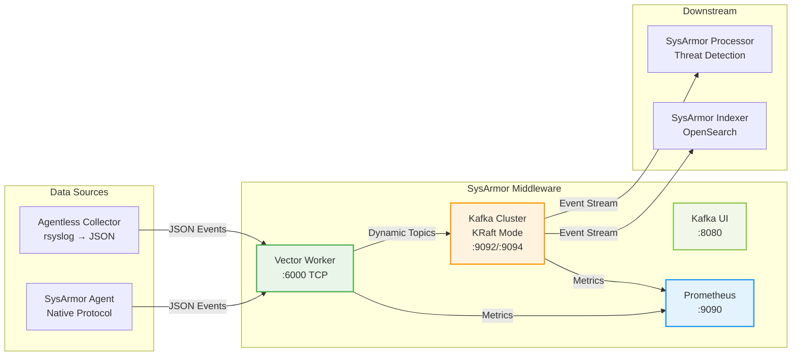

# SysArmor Middleware

SysArmor 中间件服务，基于 Vector + Kafka 架构，为 SysArmor EDR 系统提供高性能的事件流处理中间层。

## 🎯 核心功能

- **事件接收**: Vector 接收来自 Collector 的结构化 JSON 事件
- **动态路由**: 基于 collector_id 自动路由到对应的 Kafka Topic
- **消息队列**: Kafka 集群提供可靠的事件存储和分发
- **监控管理**: Kafka UI 和 Vector 指标监控

## 🏗️ 架构设计



### KRaft模式优势
- **无需Zookeeper**: 简化架构，减少运维复杂度
- **更快启动**: 消除Zookeeper依赖，启动时间更短
- **更好扩展**: 内置Raft协议，更适合云原生环境
- **统一管理**: 元数据和日志统一存储在Kafka中

## 🚀 快速开始

### 1. 启动服务

```bash
# 复制环境配置
cp .env.example .env

# 编辑配置 (重要: 更新 YOUR_PUBLIC_IP)
vim .env

# 启动所有服务
make up
```

### 2. 验证部署

```bash
# 健康检查
make health

# 访问管理界面
open http://localhost:8080  # Kafka UI
```

## 📋 Topic 路由规则

### 命名规范
```
sysarmor-agentless-{collector_id前8位}
```

### 示例
```bash
Collector ID: 558c01dd-b545-41cb-ab17-0d4290615006
Topic Name:   sysarmor-agentless-558c01dd
```

### 自动创建
- **分区数**: 3
- **副本因子**: 1  
- **保留时间**: 24小时 (86400000ms)
- **清理策略**: delete
- **段大小**: 1GB

## ⚙️ 配置

### 环境变量 (KRaft模式)

| 变量名 | 默认值 | 说明 |
|--------|--------|------|
| `KAFKA_PORT` | `9092` | Kafka 内部端口 |
| `KAFKA_EXTERNAL_PORT` | `9094` | Kafka 外部访问端口 |
| `VECTOR_TCP_PORT` | `514` | Vector TCP接收端口 |
| `VECTOR_API_PORT` | `8686` | Vector API端口 |
| `KAFKA_UI_PORT` | `8080` | Kafka UI 端口 |
| `PROMETHEUS_PORT` | `9090` | Prometheus 端口 |
| `KAFKA_LOG_RETENTION_HOURS` | `168` | 消息保留时间(7天) |
| `KAFKA_CLUSTER_ID` | `sysarmor-middleware-kafka-cluster` | KRaft集群ID |

### Vector 配置

```toml
# 接收 JSON 格式的事件
[sources.rsyslog_receiver]
type = "socket"
address = "0.0.0.0:6000"
mode = "tcp"
decoding.codec = "json"

# 动态路由到 Kafka Topic
[transforms.parse_and_route]
type = "remap"
source = '''
collector_short = slice!(.collector_id, start: 0, end: 8)
.topic = "sysarmor-agentless-" + collector_short
'''

# 输出到 Kafka
[sinks.kafka_dynamic]
type = "kafka"
topic = "{{ topic }}"
bootstrap_servers = "kafka:9092"
```

## 🛠️ 管理命令

### 基础操作

```bash
# 启动服务
make up

# 停止服务  
make down

# 重启服务
make restart

# 查看状态
make status

# 健康检查
make health

# 查看日志
make logs
```

### Kafka 管理

```bash
# 列出所有 Topics
make kafka-topics

# 创建 Topic
make kafka-create TOPIC=test-topic

# 消费消息
make kafka-consume TOPIC=sysarmor-agentless-558c01dd
```

### Vector 管理

```bash
# Vector 健康检查
make vector-health

# Vector 指标
make vector-metrics
```

## 📊 监控

### 监控架构

SysArmor Middleware 集成了完整的 Prometheus 监控体系：

- **Vector 指标**: 事件处理性能和吞吐量
- **Kafka JMX**: Broker 和 Topic 级别指标  
- **Prometheus**: 统一指标收集和查询
- **自动化**: 一键部署和健康检查

### 访问地址

- **Kafka UI**: http://localhost:8080
- **Vector API**: http://localhost:8686/health
- **Vector 指标**: http://localhost:9598/metrics
- **Kafka 指标**: http://localhost:7071/metrics
- **Prometheus**: http://localhost:9090

### 监控命令

```bash
# 设置监控 (首次使用)
make setup-monitoring

# 监控健康检查
make monitoring-health

# 查看关键指标
make key-metrics

# 打开 Prometheus UI
make prometheus-ui

# 综合健康检查
make health
```

### 详细监控指南

参见 [架构与监控指南](docs/architecture-and-monitoring.md) 了解：
- 完整的监控架构设计
- 关键指标说明和查询示例
- API 集成和客户端代码
- 性能优化和故障排查

## 🔧 故障排除

### 常见问题

1. **Vector 无法接收数据**
   ```bash
   # 检查端口
   netstat -tlnp | grep 6000
   
   # 查看 Vector 日志
   docker logs sysarmor-middleware-vector
   ```

2. **Kafka 连接失败**
   ```bash
   # 检查 Kafka 状态
   make kafka-topics
   
   # 检查监听地址配置
   echo $KAFKA_ADVERTISED_LISTENERS
   ```

3. **Topic 未自动创建**
   ```bash
   # 手动创建
   make kafka-create TOPIC=sysarmor-agentless-test
   
   # 检查自动创建配置
   docker exec sysarmor-middleware-kafka kafka-configs --describe --bootstrap-server localhost:9092 --entity-type brokers
   ```

## 🚀 部署配置

### 云服务器部署 (KRaft模式)

1. **更新公网 IP**
   ```bash
   # 编辑 .env 文件 (KRaft模式配置)
   KAFKA_EXTERNAL_PORT=9094
   YOUR_PUBLIC_IP=YOUR_SERVER_IP
   ```

2. **防火墙配置**
   ```bash
   # 开放必要端口 (KRaft模式)
   ufw allow 9094/tcp  # Kafka 外部访问
   ufw allow 514/tcp   # Vector TCP接收
   ufw allow 8686/tcp  # Vector API
   ufw allow 8080/tcp  # Kafka UI
   ufw allow 9090/tcp  # Prometheus
   ```

3. **性能优化**
   ```bash
   # 调整 Kafka 配置 (KRaft模式)
   KAFKA_NUM_NETWORK_THREADS=8
   KAFKA_NUM_IO_THREADS=16
   KAFKA_LOG_RETENTION_HOURS=168  # 7天保留
   KAFKA_NUM_PARTITIONS=3
   ```

## 📈 性能指标

### 吞吐量
- **Vector**: 10K+ events/sec
- **Kafka**: 100K+ messages/sec
- **延迟**: < 100ms (P99)

### 资源使用
- **CPU**: 2-4 cores
- **内存**: 4-8GB
- **磁盘**: 100GB+ (根据保留策略)

## 🔗 集成

### 与 SysArmor Manager 集成
- Manager 生成的脚本配置 Vector 地址
- 自动 collector_id 注入和 Topic 路由

### 与 SysArmor Processor 集成  
- Processor 消费 Kafka Topics 进行威胁检测
- 支持多 Topic 并行处理

### 与 SysArmor Indexer 集成
- 事件存储到 OpenSearch
- 支持实时搜索和分析

---

**SysArmor Middleware** - 高性能事件流处理中间层 🛡️
