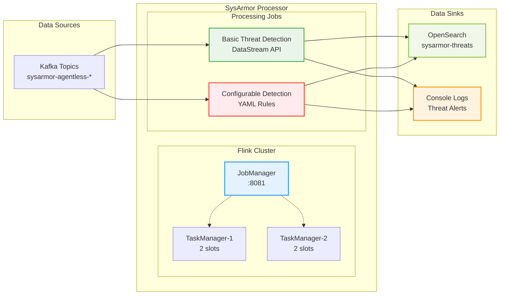

# SysArmor Processor

基于 PyFlink 1.18.1 的实时威胁检测处理器，为 SysArmor EDR 系统提供高性能的事件流处理和威胁检测能力。

## 🎯 核心功能

- **实时事件处理**: 基于 Apache Flink 的流处理引擎
- **威胁检测**: 智能威胁模式识别和风险评分
- **配置化规则**: 基于 YAML 配置文件的灵活威胁检测规则
- **容错机制**: Exactly-Once 语义和自动故障恢复
- **水平扩展**: 支持多 TaskManager 弹性扩展
- **监控告警**: 完整的指标监控和 Web UI

## 🏗️ 架构设计



## 📂 项目结构

```
sysarmor-processor/
├── docker-compose.yml          # Flink 集群服务编排
├── Makefile                    # 管理命令
├── README.md                   # 项目文档
├── .env.example               # 环境变量模板
├── docker/                     # Docker 配置
│   ├── Dockerfile              # 自定义 Flink 镜像
│   ├── requirements.txt        # Python 依赖
│   └── download_libs.sh        # JAR 依赖下载脚本
├── jobs/                       # PyFlink 作业文件
│   ├── job_rules_filter_datastream.py      # 基础威胁检测作业
│   └── job_rules_configuration_datastream.py # 配置化威胁检测作业
├── config/                     # 配置文件目录
│   └── threat_detection_rules.yaml # 威胁检测规则配置
└── docs/                       # 文档目录
```

## 🚀 快速开始

### 1. 环境准备

```bash
# 克隆项目
git clone <repository>
cd sysarmor-processor

# 初始化环境
make setup
```

### 2. 配置环境变量

复制并编辑环境变量文件：

```bash
cp .env.example .env
```

配置 Kafka 和 OpenSearch 连接信息：

```bash
# Kafka 配置
KAFKA_BOOTSTRAP_SERVERS=101.42.117.44:9093
KAFKA_GROUP_ID=sysarmor-processor-group

# OpenSearch 配置
OPENSEARCH_HOST=localhost
OPENSEARCH_PORT=9201
OPENSEARCH_USERNAME=admin
OPENSEARCH_PASSWORD=admin
THREATS_INDEX=sysarmor-threats

# Flink 配置
FLINK_PARALLELISM=2
FLINK_CHECKPOINT_INTERVAL=30s
```

### 3. 启动 Flink 集群

```bash
# 启动集群
make up

# 检查服务状态
make status

# 查看 Web UI
open http://localhost:8081
```

### 4. 提交作业

```bash
# 提交配置化威胁检测作业 (推荐)
make submit-configurable

# 或提交基础威胁检测作业
make submit-datastream

# 查看作业状态
make list-jobs
```

## 📋 作业说明

### 1. 基础威胁检测作业 (`job_rules_filter_datastream.py`)

**功能**: 基于 DataStream API 的威胁检测，内置威胁检测规则

**特性**:
- 使用 DataStream API 进行更好的错误处理
- 有状态的连续 sudo 检测，具有内存功能
- 增强的调试和日志记录功能
- 所有威胁都会在控制台打印，前缀为 'THREAT_DETECTED'

**数据流**:
```
Kafka (sysarmor-agentless-*) → Threat Detection → Console + OpenSearch
```

### 2. 配置化威胁检测作业 (`job_rules_configuration_datastream.py`) - 推荐

**功能**: 基于 YAML 配置文件的灵活威胁检测系统

**特性**:
- 基于 `threat_detection_rules.yaml` 配置文件
- 动态规则加载和热重载支持
- 频率基础威胁检测与时间窗口
- 灵活模式匹配 (关键词 + 正则 + 条件)
- 可配置风险评分和严重程度
- 规则分组和分类支持
- 所有威胁都会在控制台打印，前缀为 'CONFIG_THREAT_DETECTED'

**数据流**:
```
Kafka (sysarmor-agentless-*) → YAML Rules Engine → Risk Scoring → Console + OpenSearch
```

## 🛠️ 管理命令

### 集群管理

```bash
# 启动 Flink 集群
make up

# 停止 Flink 集群
make down

# 清理集群和数据
make clean

# 查看服务状态
make status

# 查看日志
make logs
```

### 作业管理

```bash
# 提交作业
make submit-configurable  # 配置化威胁检测作业 (推荐)
make submit-datastream    # 基础威胁检测作业

# 管理作业
make list-jobs            # 列出所有作业
make cancel-job JOB_ID=xxx  # 取消指定作业
```

### 开发环境

```bash
# 初始化开发环境
make setup

# 查看帮助信息
make help
```

## ⚙️ 配置说明

### 环境变量配置

| 变量名 | 默认值 | 说明 |
|--------|--------|------|
| `KAFKA_BOOTSTRAP_SERVERS` | `101.42.117.44:9093` | Kafka 集群地址 |
| `KAFKA_GROUP_ID` | `sysarmor-processor-group` | Kafka 消费者组 |
| `OPENSEARCH_HOST` | `localhost` | OpenSearch 主机 |
| `OPENSEARCH_PORT` | `9201` | OpenSearch 端口 |
| `OPENSEARCH_USERNAME` | `admin` | OpenSearch 用户名 |
| `OPENSEARCH_PASSWORD` | `admin` | OpenSearch 密码 |
| `THREATS_INDEX` | `sysarmor-threats` | 威胁索引名 |

### Flink 配置

| 配置项 | 默认值 | 说明 |
|--------|--------|------|
| `FLINK_PARALLELISM` | `2` | 默认并行度 |
| `taskmanager.numberOfTaskSlots` | `2` | TaskManager 槽位数 |
| `taskmanager.memory.process.size` | `2048m` | TaskManager 内存 |
| `jobmanager.memory.process.size` | `1024m` | JobManager 内存 |

### 威胁检测规则配置

配置化威胁检测作业使用 `config/threat_detection_rules.yaml` 文件定义检测规则：

```yaml
rules:
  - name: "Suspicious Command Execution"
    category: "command_injection"
    severity: "high"
    risk_score: 75
    patterns:
      - "nc -l"
      - "bash -i"
      - "/bin/sh"
    conditions:
      frequency: 3
      time_window: "5 minutes"
```

## 📊 监控和指标

### Web 界面

- **Flink Web UI**: http://localhost:8081
  - 作业监控和管理
  - Checkpoint 状态
  - TaskManager 资源使用

### 关键指标

- **吞吐量**: records/sec
- **延迟**: 处理延迟 (P50, P95, P99)
- **背压**: 任务背压状态
- **资源**: CPU 和内存使用率

## 🔧 故障排除

### 常见问题

1. **作业提交失败**
   ```bash
   # 检查集群状态
   make status
   
   # 查看日志
   make logs
   
   # 重启集群
   make down && make up
   ```

2. **Kafka 连接失败**
   ```bash
   # 检查 Kafka 配置
   cat .env | grep KAFKA
   
   # 测试网络连接
   telnet 101.42.117.44 9093
   ```

3. **OpenSearch 写入失败**
   ```bash
   # 检查 OpenSearch 状态
   curl -u admin:admin http://localhost:9201/_cluster/health
   
   # 检查索引
   curl -u admin:admin http://localhost:9201/_cat/indices
   ```

4. **容器启动失败**
   ```bash
   # 查看详细日志
   docker compose logs flink-jobmanager
   docker compose logs flink-taskmanager
   
   # 重新构建镜像
   make clean && make up
   ```

## 📈 性能调优

### 增加并行度

```bash
# 修改 .env 文件
FLINK_PARALLELISM=4

# 重启集群
make down && make up
```

### 扩展 TaskManager

```bash
# 修改 docker-compose.yml
services:
  flink-taskmanager:
    scale: 2  # 增加到2个TaskManager
```

### 调整内存配置

```bash
# 修改 docker-compose.yml 中的环境变量
taskmanager.memory.process.size: 4096m
jobmanager.memory.process.size: 2048m
```

## 🔗 集成

### 与 SysArmor Middleware 集成

```bash
# Middleware 配置 Kafka Topics
sysarmor-agentless-558c01dd
sysarmor-agentless-7bb885a8

# Processor 消费这些 Topics
KAFKA_TOPICS=sysarmor-agentless-558c01dd,sysarmor-agentless-7bb885a8
```

### 与 SysArmor Indexer 集成

```bash
# Processor 写入 OpenSearch 索引
THREATS_INDEX=sysarmor-threats

# Indexer 提供搜索和可视化
http://localhost:5602  # OpenSearch Dashboards
```

### 与 SysArmor Manager 集成

```bash
# Manager 可以查询威胁事件
curl -u admin:admin "http://localhost:9201/sysarmor-threats/_search"
```

## 📖 技术栈

- **Apache Flink 1.18.1**: 流处理引擎
- **PyFlink**: Python API for Flink
- **Kafka**: 消息队列
- **OpenSearch**: 搜索和分析引擎
- **Docker**: 容器化部署
- **Docker Compose**: 服务编排

---

**SysArmor Processor** - 基于 PyFlink 的实时威胁检测引擎 🛡️

**核心特性**:
- ✅ **生产级架构**: Apache Flink 1.18.1 稳定版本
- ✅ **智能检测**: 多层威胁检测和风险评分
- ✅ **配置化规则**: YAML 配置文件支持动态规则
- ✅ **高性能**: 万级 TPS + 毫秒级延迟
- ✅ **容错机制**: Exactly-Once + 自动故障恢复
- ✅ **易于运维**: Web UI + 完整监控
- ✅ **水平扩展**: TaskManager 弹性扩展
- ✅ **简化部署**: Docker Compose 一键启动
